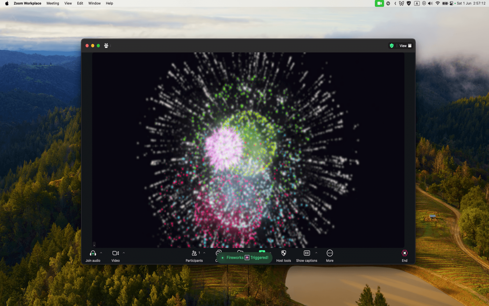

# Video Call Reactions Extension for Raycast

## Overview
The **Video Call Reactions** extension for Raycast adds a dash of fun to your macOS video calls. With just a few keystrokes, you can trigger visual effects such as hearts, thumbs up/down, balloons, rain, confetti, fireworks, and lasers. Work only with macOS Sequoia 15.0

## Features
- **Instant Access**: Quickly launch reactions with a single Raycast command.
- **Diverse Reactions**: A broad selection of reactions to express yourself during video calls.
- **Tailored Experience**: Set your default reaction and configure settings to personalize your experience.
- **Audiovisual Flair**: Enhance certain reactions with optional sound effects, like the celebratory cheer accompanying confetti, or the Raycast's confetti visual effect.

## Quick Start
1. Download from the Raycast Store.
2. Personalize your settings in the extension preferences.
3. Effortlessly trigger reactions during video calls.

## Usage
Open the Raycast command palette, choose the **Trigger Reaction** command, and select the reaction to display in your video call.

## Preferences
- **Default Reaction**: Set a default reaction to be triggered when the extension is activated.
- **Confetti Display**: Toggle the Raycast's confetti effect on or off.
- **Sound Effects**: Opt to play a sound when the Raycast's confetti effect is activated.

## Requirements
To utilize the Video Call Reactions extension, ensure you have:
- macOS with Raycast installed.
- macOS Sonoma or later on a Mac with Apple silicon, or macOS Sonoma or later on a Mac using Continuity Camera with iPhone 12 or later. Visit [Apple Support](https://support.apple.com/en-us/105117) for more details.
- A compatible video calling application that supports on-screen reactions.

## Support
Encountering issues or have suggestions? Open an issue on our GitHub repository.

## Example

## License
This extension is available under the MIT License. We welcome contributions and forks.

Animate your video calls with the **Video Call Reactions** extension for Raycast!