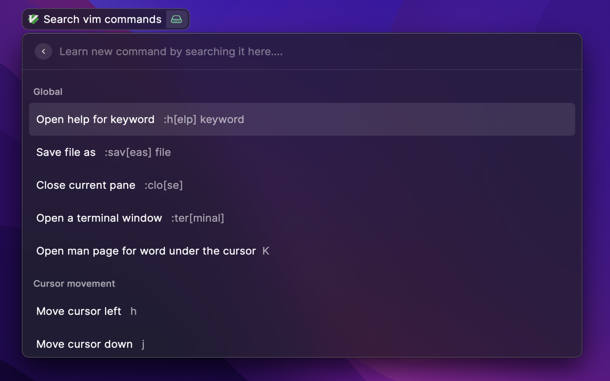
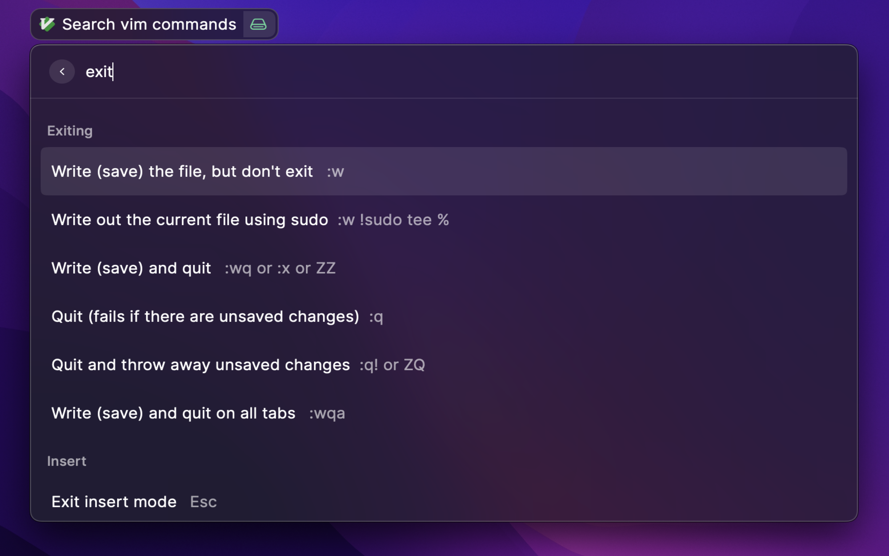
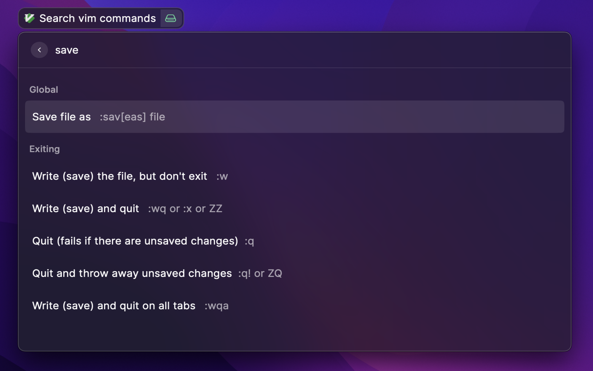

# Vim Bro

Learn vim commands without leaving your window.

## Roadmap

- [x] Search text to find commands.
- [ ] Command lookup: Find what command does by typing command.
- [ ] Command of the day

Connect with on slack @ajaypremshankar or [Ajay Prem Shankar on Linkedin](https://www.linkedin.com/in/ajaypremshankar/) for suggestions and contributions.
