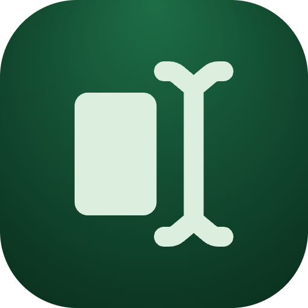

<p align="center">
  
  <h1 align="center">Vision OCR</h1>
</p>

Local Raycast OCR for clipboard images, copied files, selected Finder files, and picked files. It uses Apple Vision through Raycast's Swift bridge, so OCR runs on-device.

> [!CAUTION]
> **Disclaimer:** This project was developed with heavy use of AI assistance. Tested and verified by the author.

## Commands

- **Extract Text from Clipboard**: reads the current clipboard image or copied image/PDF file, runs OCR, and copies or pastes recognized text.
- **Extract Text with Options**: choose clipboard or files, language, recognition level, and output for a one-off run.
- **Extract Text from Selected Files**: runs OCR on the currently selected Finder files.
- **OCR History**: reviews recent OCR outputs.

## Preferences

- **Primary Language**: optional main OCR language. Leave as Automatic for Vision defaults.
- **Extra Languages**: optional comma-separated BCP-47 language tags, for example `en-US, ar`.
- **Recognition Level**: Accurate or Fast.
- **Clipboard Command Output**: copy recognized text or paste it into the frontmost app.

## Develop

```sh
npm install
npm run dev
```

## Build

```sh
npm run build
```

## Hotkey

Assign a Raycast hotkey to **Extract Text from Clipboard** for the fastest flow: copy screenshot or image, press the hotkey, then paste the recognized text.

## Deeplink

```text
raycast://extensions/yshalsager/vision-ocr/ocr-clipboard?launchType=background
```

## Quick Test

1. Copy an image to the clipboard, for example with `Cmd + Ctrl + Shift + 4`.
2. Run **Extract Text from Clipboard** in Raycast.
3. Paste anywhere with `Cmd + V`; the clipboard should now contain recognized text.
