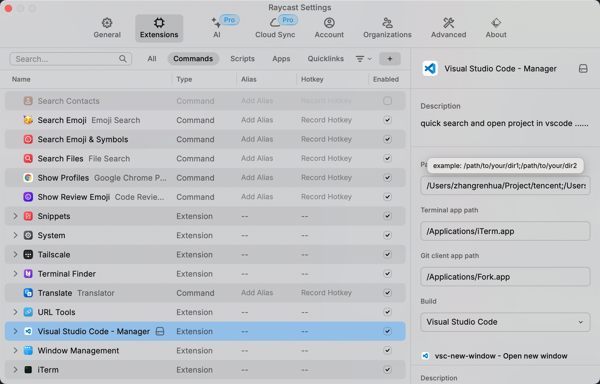
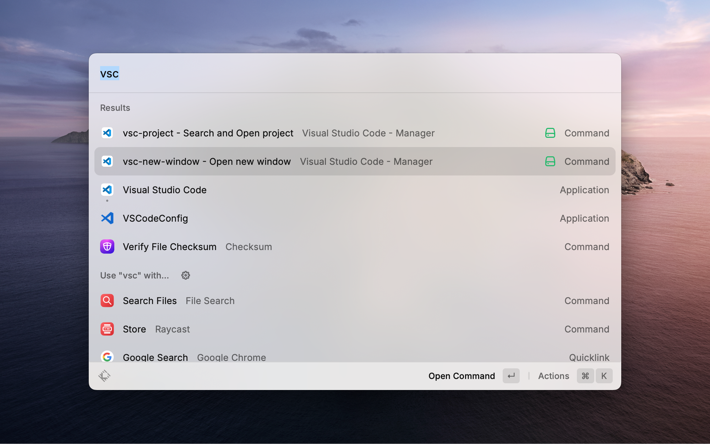

# visual-studio-code-manager

quick search and open project in vscode ......

## intro


## usage

### set project dirs

use **;** split string

```
/path/to/your/dir1;/path/to/your/dir2;/path/to/your/dir3
```



### search and open project

```
vsc-project
```


### open new window

```
vsc-new-window
```



