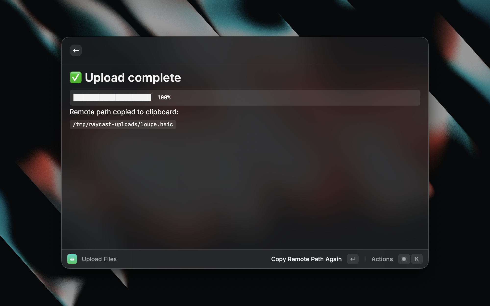

# ☁️ VPS Upload

> Upload files to your server over SSH and get the remote path on your clipboard.



A Raycast extension for referencing local files inside a remote SSH session. When you work over SSH (say an AI coding agent on your VPS), a local macOS path means nothing on the server. VPS Upload sends the file across and hands you the remote path, ready to paste.

## Features

- **One hotkey, no window.** Select files in Finder and run *Upload Finder Selection*.
- **Or pick and drop.** Use *Upload Files* for a form with a live progress bar.
- **Clipboard, instantly.** The remote path is copied the moment the upload starts.
- **In-app setup.** Configure your host inside Raycast, no Settings trip.
- **No dependencies.** Streams over `ssh`, with accurate progress.

## Setup

1. Install from the Raycast Store (or run locally: `npm install && npm run dev`).
2. On first run, enter your **SSH Host** (an `~/.ssh/config` alias like `vps`, or `user@host`) and a **Remote Directory**.
3. Confirm key-based login works (no password prompt):
   ```sh
   ssh -o BatchMode=yes <host> true
   ```
   If that hangs or errors, set up an SSH key first with `ssh-copy-id <host>`.

## Usage

- **Fast path:** select file(s) in Finder, run *Upload Finder Selection* (give it a hotkey).
- **Manual:** run *Upload Files*, then pick or drop files.

Either way, paste the copied remote path into your SSH session.

## How it works

Files stream through `ssh <host> "cat > <remote>"`, and progress is measured from the bytes piped locally. There is no pseudo-tty and no extra tooling. `scp` is avoided on purpose because it only prints a progress meter to a real terminal, which Raycast's runtime cannot provide. Remote filenames are sanitized to `[A-Za-z0-9._-]`, so the pasted path never needs quoting.

## Requirements

- macOS with Raycast
- A host reachable with key-based, non-interactive SSH login

## License

[MIT](LICENSE)
