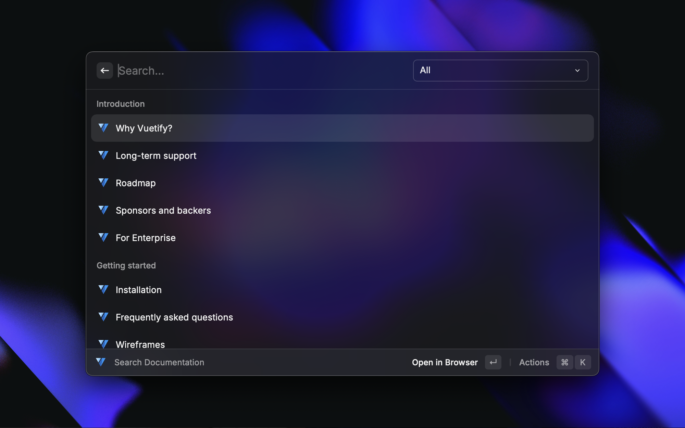
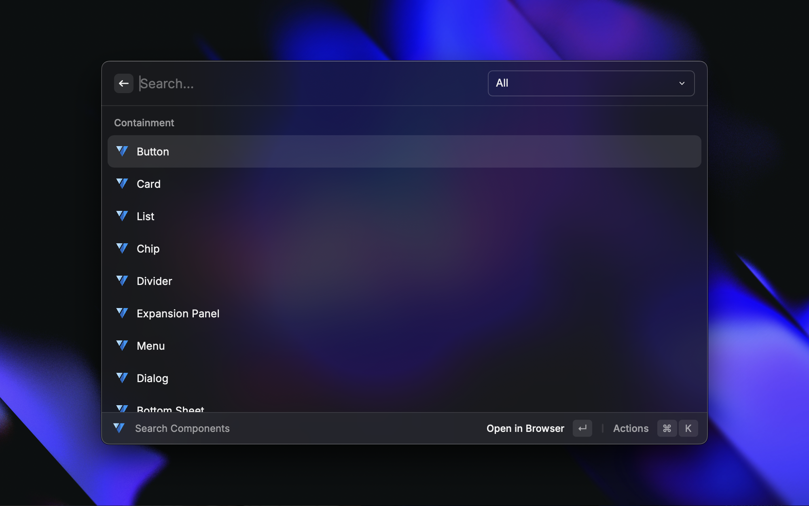

# Vuetify Docs

A Raycast extension to quickly search and open [Vuetify](https://vuetifyjs.com/en/) documentation and components in your browser.

## Features

### 🔍 Search Documentation
Search the Vuetify documentation and open the relevant page in your browser.

### 📦 Search Components
Find Vuetify components and directly access their documentation in your browser.

