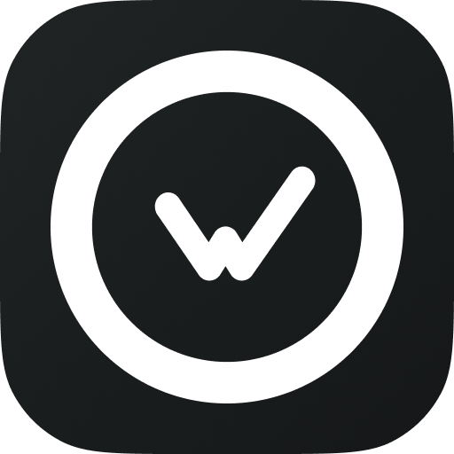

  
  <h1>WakaTime</h1>
  
Raycast extension to view your coding stats and rank from <a href="https://wakatime.com">wakatime.com</a>

## Features

- View your coding stats over multiple ranges (Today, Yesterday, Last 7 Days, e.t.c)
- View your most used languages and recent projects
- View your current rank in the global and private leaderboards

## API Key

We need your WakaTime API Key to allow us to access your data.

The same one you use with your plugins and other intergrations. Go to [https://wakatime.com/settings/api-key](https://wakatime.com/settings/api-key).
