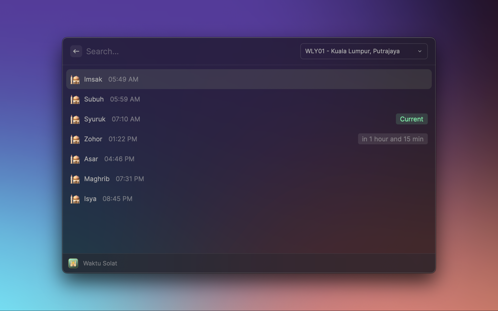

# Waktu Solat

View Malaysia prayer times from [JAKIM](https://www.e-solat.gov.my/) directly in Raycast.

## Features

- View today's prayer times for Malaysian zones.
- Choose a zone from the prayer-times command.
- Display the current and next prayer in the menu bar.

## Usage

1. Open Raycast and search for **Waktu Solat**.
2. Select your Malaysian prayer zone from the dropdown.
3. Use **Waktu Solat Menu Bar** to show the current or upcoming prayer in the menu bar.

The selected zone is shared between the command and the menu-bar item. The menu-bar command refreshes every five minutes.

## Preferences

Open **Raycast Settings → Extensions → Waktu Solat** to configure the menu bar:

- **Show icon in menu bar** — Show or hide the mosque icon.
- **Menu bar icon color** — Choose a white or black mosque icon.
- **Menubar template** — Customize the title using `$name` for the prayer name and `$time` for its time. The default is `$name at $time`.
- **Offset before prayer time** — Number of minutes during which the next prayer is shown before it starts. The default is 30 minutes.
- **Offset after prayer time** — Number of minutes during which the current prayer remains shown after it starts. The default is 30 minutes.

## Data source

Prayer times and zone information are retrieved from JAKIM's [e-Solat service](https://www.e-solat.gov.my/). An internet connection is required when data is not already cached locally.

## License

Waktu Solat is available under the MIT License.
