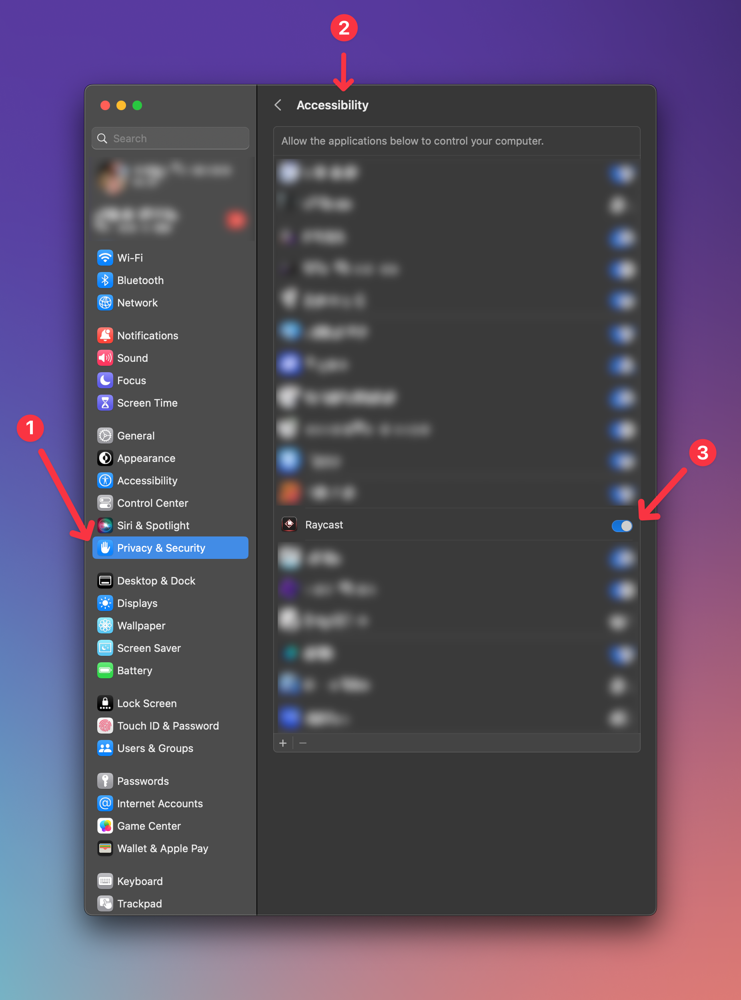

# Warp Launch Configuration

Before you use this extension, ensure that Raycast has **Accessibility** permissions. You can check this in **System Preferences** > **Security & Privacy** > **Privacy** > **Accessibility**.

## Why does this extension need Accessibility permissions?

This extension is not an official Warp extension as they don't have deep integration with Raycast. When you select a launch configuration, it runs a script command (JXA) that opens Warp and opens your launch configuration. This script command needs Accessibility permissions to open Warp and type the proper command.
