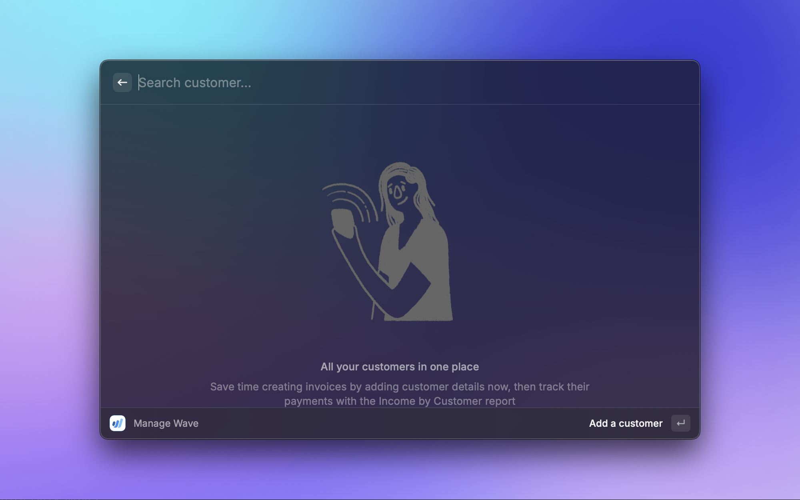
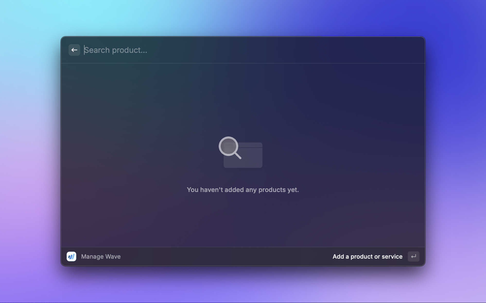

    

# Wave

This is a Raycast extension for [Wave](https://www.waveapps.com/). It allows you to view your Wave Businesses and their associated Invoices, Customers and even some Customer Statements 👀.

## 📜 Disclaimer

As of _May 23, 2025_:
> Users can only grant access to businesses that have an active Pro or Wave Advisor subscription with Wave.

([Link to relevant part in OAuth Guide](https://developer.waveapps.com/hc/en-us/articles/360019493652-OAuth-Guide#:~:text=Please%20note%3A%20Users%20can%20only%20grant%20access%20to%20businesses%20that%20have%20an%20active%20Pro%20or%20Wave%20Advisor%20subscription%20with%20Wave.))

For users on Free Plan, please follow step 3 i.e. **Use Access Token**

## 🚀 Getting Started

1. **Install extension**: Click the `Install Extension` button in the top right of [this page](https://www.raycast.com/xmok/wave) OR `install` via Raycast Store

2. **Connect your Wave account**: The extension uses **OAuth2** to allow you to securely log in:

    a. `Run` any command

    b. `Click` to **Sign in with Wave** when prompted

    c. `Log In` (if not already) and `Allow` the application access

    d. `Enjoy` the extension!

3. **(OPTIONAL) Use Access Token**: Instead of logging in via Wave you might prefer to use an access token which has all permissions:

    a. `Navigate` to [Manage Applications](https://developer.waveapps.com/hc/en-us/articles/360019762711-Manage-Applications)

    b. `Log In` and click `Create an application`

    - Name: e.g. Raycast Extension
    - Description: e.g. Raycast Extension Access Token
    - Redirect URIs: https://raycast.com/redirect?packageName=Extension
    - Logo: e.g. Upload image of your choice

    c. `Read` ToS and `click` **Yes, I agree**

    d. `Click` on **Create your application**

    e. Once your application is approved, go back to [Manage Applications](https://developer.waveapps.com/hc/en-us/articles/360019762711-Manage-Applications)

    f. `Select` your application

    g. `Create token` under **Full Access tokens**

    h. `Copy` and `Paste` this in Preferences
    
## 🗒️ NOTES

- If you enter `Access Token` in `Preferences` this will take precedence over OAuth but you can switch to OAuth by deleting the token from Preferences
- This extension is using Raycast's own [PKCE proxy](https://oauth.raycast.com/) so security is ensuerd.

## 🖼️ Media

EmptyView

