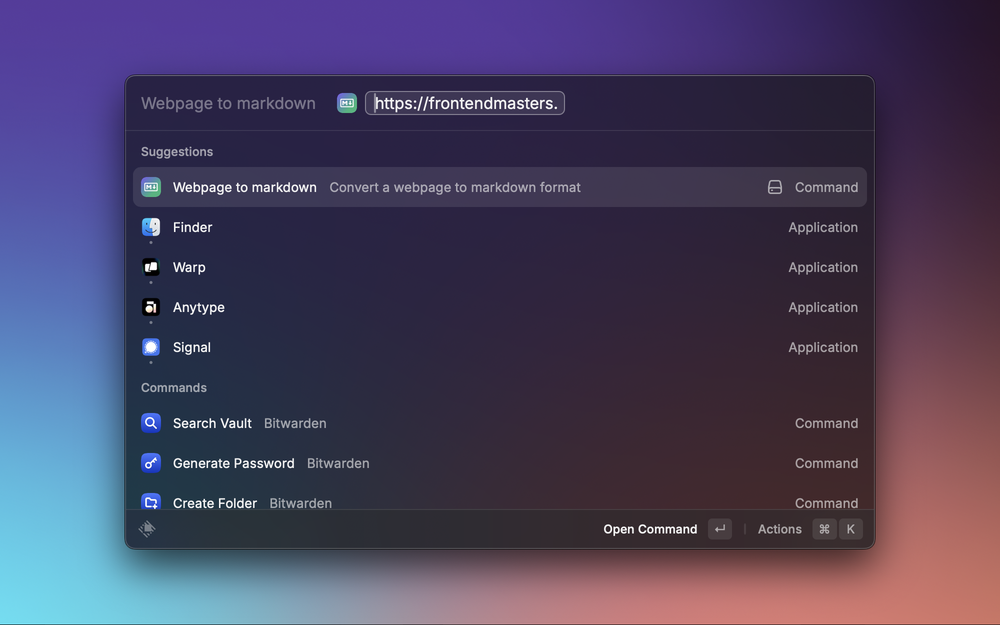
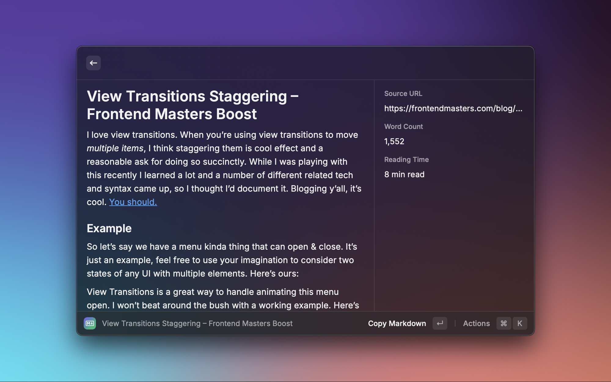

# Webpage to Markdown

  
  
  

  
Transform any webpage into clean markdown. View directly in Raycast or copy to clipboard. Perfect for developers, note-takers and content-creators who need to save web content in markdown format.

## Features

- Clean, instant conversion of web content to markdown
- Smart metadata tracking (word count, reading time)
- Automatic link collection and organization
- YAML front matter support for better organization
- Powered by Jina.ai's Reader API for reliable conversion

## Actions

- Copy markdown output (`↵`)
- Open original webpage (`⌘` + `↵`)

## Preferences

- Include metadata sidebar (word count, reading time, source URL)
- Add YAML front matter with metadata
- Include organized links summary at the end
- Add Jina.ai API key for higher rate limits

## Examples

<table>
  <tr>
    <th>Input</th>
    <th>Output</th>
  </tr>
  <tr>
    <td></td>
    <td></td>
  </tr>
</table>
