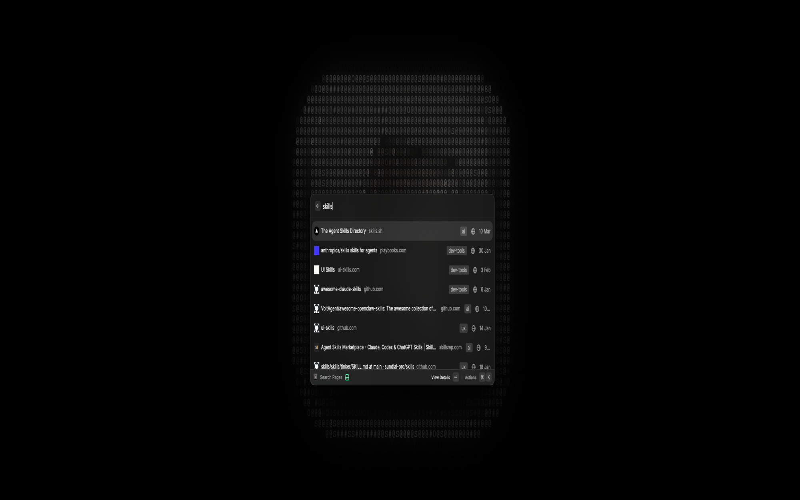
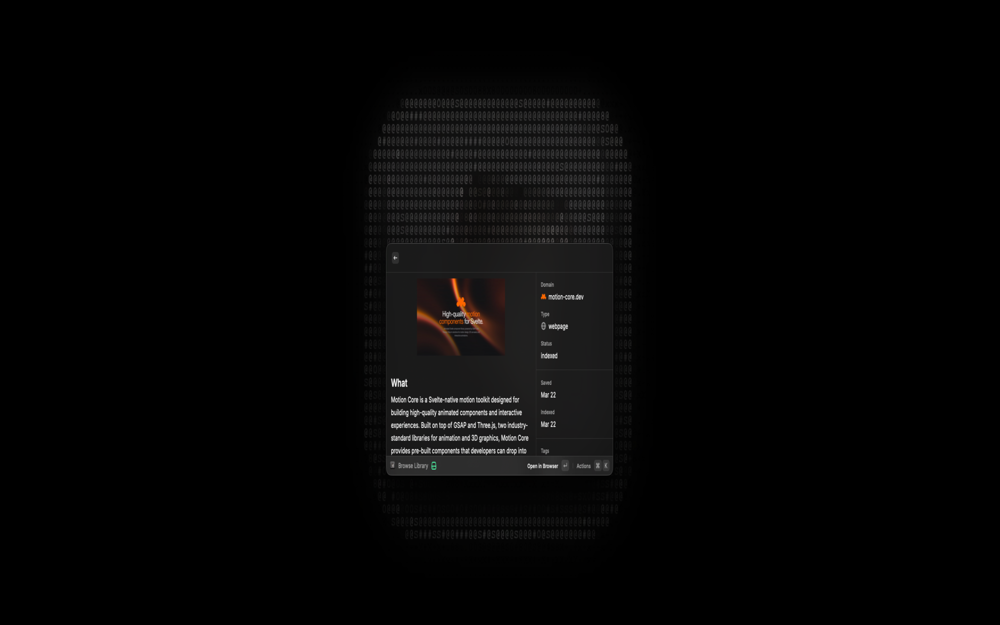

# WebStashAI

Search, save, and manage your [WebStash](https://webstashai.com) bookmark library directly from Raycast. WebStashAI brings your full library — pages, highlights, tags, collections, and spaced repetition reviews — into a fast, keyboard-native interface.

## Prerequisites

- A [WebStash](https://webstashai.com) account (Free or Pro)
- An API key from your [WebStash dashboard](https://app.webstashai.com/settings/api-keys) (starts with `wsk_`)
- [Raycast](https://raycast.com) installed on macOS

## Setup

1. Install the extension from the Raycast Store
2. Open any WebStashAI command in Raycast
3. Paste your API key when prompted (Raycast will ask automatically on first launch)
4. Start searching your library

## Commands

| Command | Description |
|---------|-------------|
| **Search Pages** | Hybrid semantic + keyword search across your entire library |
| **Browse Library** | Paginated list of all saved pages with status, domain, and tag filters |
| **Save Page** | Save a URL with optional title — auto-fills from clipboard |
| **View Highlights** | Browse and search all highlights across pages |
| **Browse Tags** | View, rename, and merge tags grouped by type |
| **Browse Collections** | Explore auto-generated topic collections |
| **Review Highlights** | Spaced repetition review with Soon/Later/Someday/Discard feedback |
| **Synthesize** | Generate AI-powered briefings across your saved pages |
| **Library Stats** | View page counts, quota usage, top domains, and top tags |
| **Import Bookmarks** | Bulk import from HTML, CSV, or a list of URLs |
| **Background Sync** | Silent background cache refresh every 30 minutes |

## Features

### Search & Browse

- **Hybrid search** — combines semantic understanding with keyword matching for accurate results
- **Instant load** — cached data renders immediately; background revalidation keeps it fresh
- **Infinite scroll** — cursor-based pagination loads more pages as you scroll
- **Inline filters** — filter by status, domain, or tag without leaving the list

### Page Detail

- Rich metadata sidebar with domain, item type, status, dates, tags, and URL
- OG image thumbnails for visual context
- Full markdown content view
- Related pages discovery

### Page Management

- Toggle favorite and pinned status with keyboard shortcuts
- Edit tags, update titles, add notes
- Reindex pages or delete with confirmation
- Optimistic UI — actions feel instant with automatic rollback on failure

### Highlights & Review

- Browse all highlights with source page context
- Add new highlights and notes to any page
- Spaced repetition review with keyboard-driven feedback (Cmd+1/2/3/4)
- Recall probability visualization and deck progress tracking

### AI Synthesis

- Generate structured briefings on any topic from your library
- See AI quota usage before submitting
- Copy or paste results directly into any app

### Import

- Import from browser bookmark exports (HTML) or spreadsheets (CSV)
- Paste a list of URLs for bulk saving
- Progress tracking for large imports

## Keyboard Shortcuts

| Shortcut | Action |
|----------|--------|
| `Enter` | Open page in browser |
| `Cmd+F` | Toggle favorite |
| `Cmd+P` | Toggle pin |
| `Ctrl+X` | Delete (with confirmation) |
| `Cmd+1` | Review: Soon |
| `Cmd+2` | Review: Later |
| `Cmd+3` | Review: Someday |
| `Cmd+4` | Review: Discard |

## Deeplinks

The Search Pages command supports deeplink arguments for integration with other tools:

```
raycast://extensions/webstashai/webstashai/search-pages?arguments={"query":"react hooks"}
```

## Screenshots

<details>
<summary>Search Pages</summary>


</details>

<details>
<summary>Page Detail</summary>


</details>

<details>
<summary>Review Highlights</summary>


</details>
