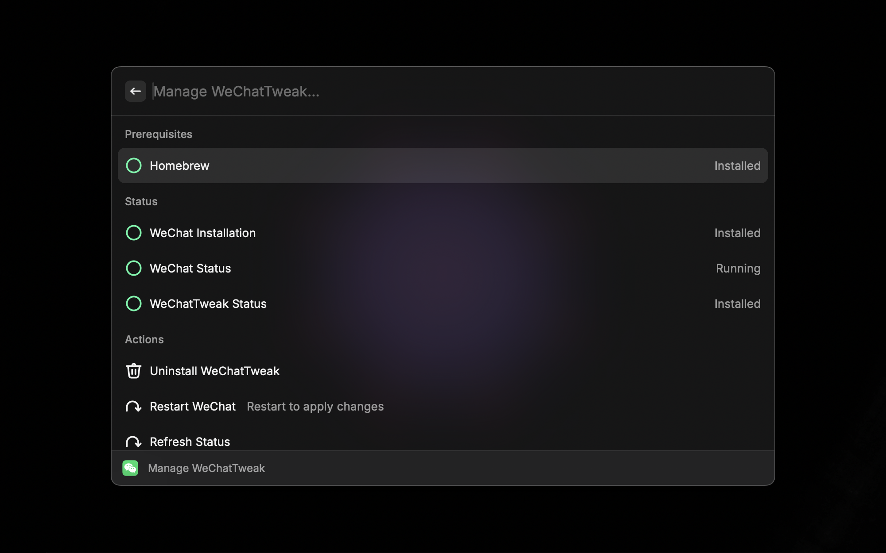

# WeChat

A [Raycast](https://www.raycast.com) extension for WeChat to quickly search your contacts and chat.

## Requirements

1. Install [WeChat for Mac](https://www.wechat.com)
2. Install [WeChatTweak-macOS](https://github.com/Sunnyyoung/WeChatTweak-macOS)

## Features

- [x] Search Contact / 搜索微信通讯录好友
- [x] Open Contact / 打开微信好友
- [x] List WeChat ID / 显示好友微信ID
- [x] Display Avatar / 显示微信头像
- [x] Pinned Contacts / 置顶好友
- [x] Recent Contacts / 最近联系人
- [x] Support fuzzy Query / 微信通讯录模糊查询
- [x] Manage WeChatTweak / 管理WeChatTweak

## Shortcuts
`Enter` Open WeChat Contact / 打开微信好友

`Command + c`Copy WeChat Contact ID / 复制微信好友ID

`Command + Shift + p` Pin WeChat Contact / 置顶好友

`Command + Shift + x` Clear Search History / 清除好友搜索记录

## How to Use

- Raycast Store

- Manual Install

`npm install && npm run dev`

## License

[MIT](LICENSE)
