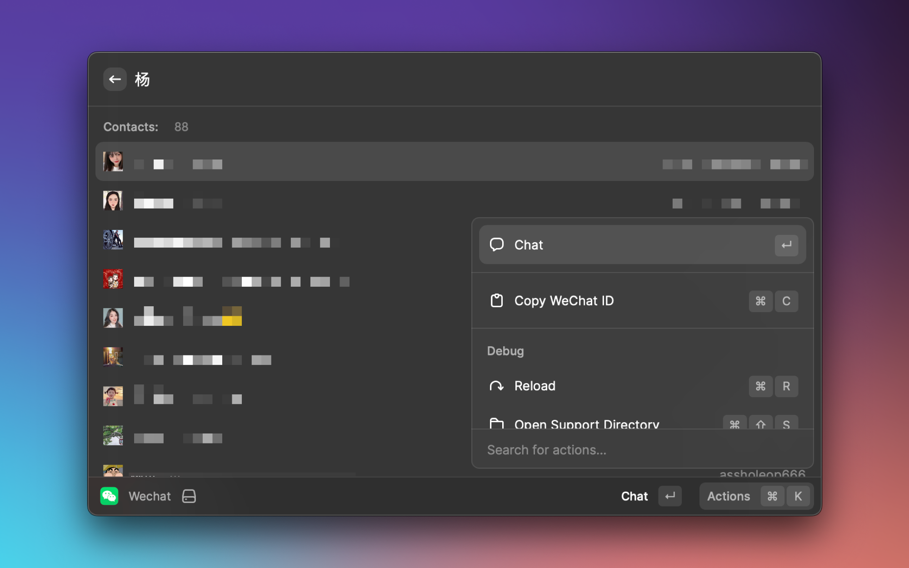

# WeChat

A [Raycast](https://www.raycast.com) extension for WeChat to quickly search your contacts and chat.

## Requirement

1. Install [WeChat for Mac](https://www.wechat.com)
2. Install [WeChatTweak-macOS](https://github.com/Sunnyyoung/WeChatTweak-macOS)

## Todo

- [x] Search Contact
- [x] List Search Contact Numbers
- [x] Open Contact
- [x] List WeChat ID
- [x] Copy WeChat ID
- [x] Display Avatar
- [x] Fix some bug
- [x] Upload to Raycast Store
- [x] Detect if Wechat is installed
- [ ] Support fuzzy query
- [ ] Chat directly inside Rycast without opening WeChat
- [ ] View WeChat History
- [ ] Toggle WeChat Function

## How to Use

before I create the final version and release it to the Raycast Store,
you can use it with:

`npm install && npm run dev`

## License

[MIT](LICENSE)
