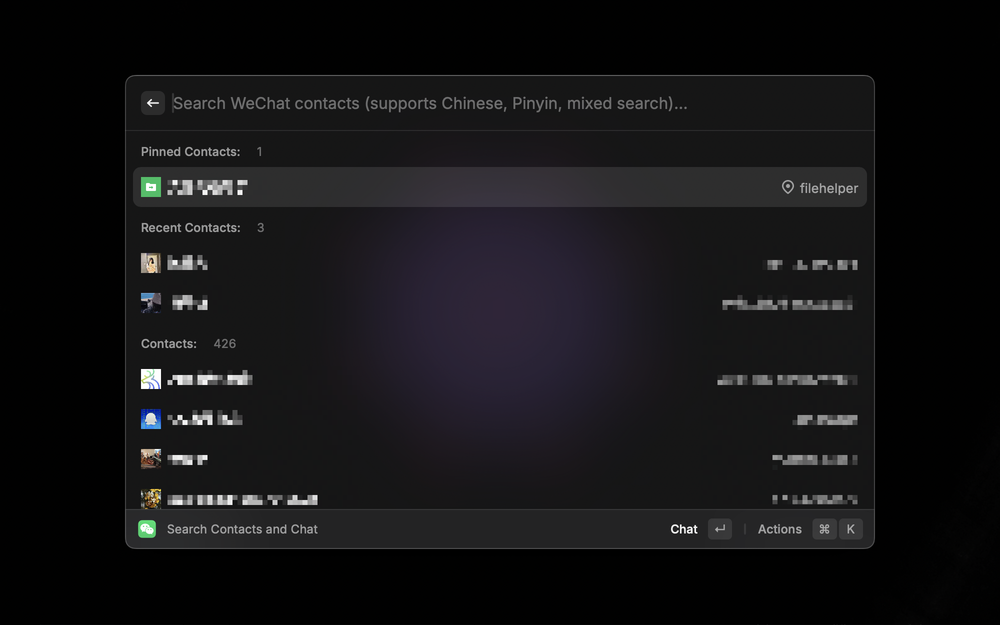
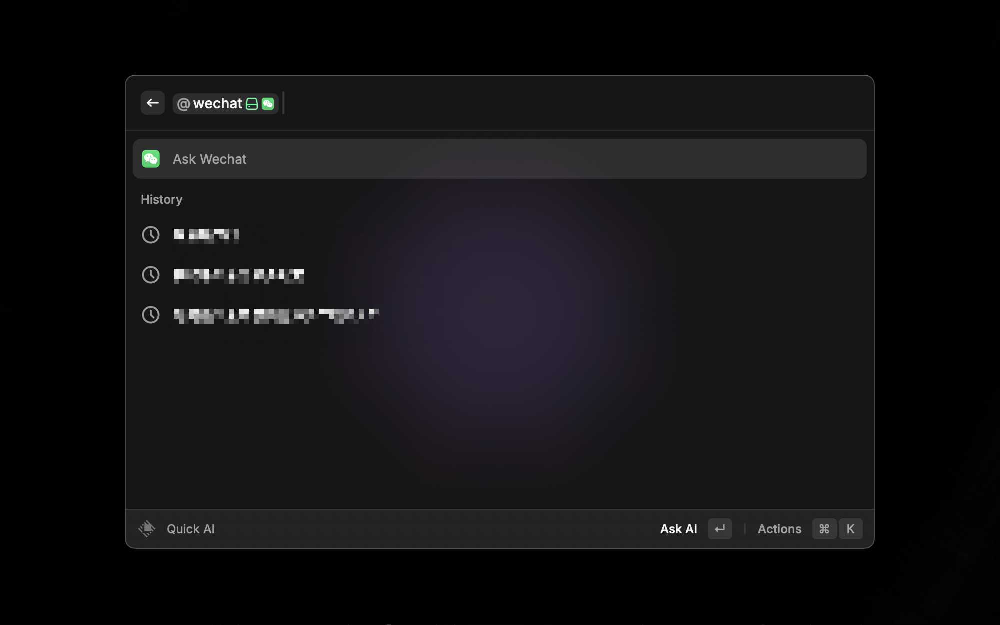

# WeChat

A [Raycast](https://www.raycast.com) extension for WeChat to quickly search your contacts and chat.

## Requirements

1. Install [WeChat for Mac](https://www.wechat.com)
2. Install [WeChatTweak-macOS](https://github.com/Sunnyyoung/WeChatTweak-macOS)

## Features

- [x] Search Contact / 搜索微信通讯录好友
- [x] Open Contact / 打开微信好友
- [x] List WeChat ID / 显示好友微信ID
- [x] Display Avatar / 显示微信头像
- [x] Pinned Contacts / 置顶好友
- [x] Recent Contacts / 最近联系人
- [x] Support fuzzy Query / 微信通讯录模糊查询
- [x] Manage WeChatTweak / 管理WeChatTweak
- [x] Generate AI Message / 生成AI消息
- [x] Add Raycast AI @wechat / 添加Raycast AI @wechat

## Shortcuts
`Enter` Open WeChat Contact / 打开微信好友

`Command + c`Copy WeChat Contact ID / 复制微信好友ID

`Command + Shift + p` Pin WeChat Contact / 置顶好友

`Command + Shift + x` Clear Search History / 清除好友搜索记录

`Command + Shift + a` Generate AI Message / 生成AI消息

## How to Use

- Raycast Store

- Manual Install

`npm install && npm run dev`

## Note
### Multi-Language Support

**English**:
While it's technically possible to add Simplified Chinese support to this extension, since the Raycast platform currently only supports English, we've decided to maintain English-only to avoid a disjointed user experience. When Raycast adds multi-language support in the future, we will promptly add corresponding language support to our extension.

**中文**：
虽然技术上可以为此扩展添加简体中文支持，但由于 Raycast 平台目前仅支持英文界面，为避免用户体验割裂，我们暂时保持扩展与平台一致使用英文。当 Raycast 未来支持多语言时，我们将及时跟进添加相应语言支持。

### WeChat Version
该插件当前支持微信4.0以下版本，微信4.0以上版本[参考这里](https://github.com/sunnyyoung/WeChatTweak-macOS/issues/832)

This extension currently supports WeChat versions below 4.0, WeChat versions above 4.0 [refer here](https://github.com/sunnyyoung/WeChatTweak-macOS/issues/832)

## License

[MIT](LICENSE)
