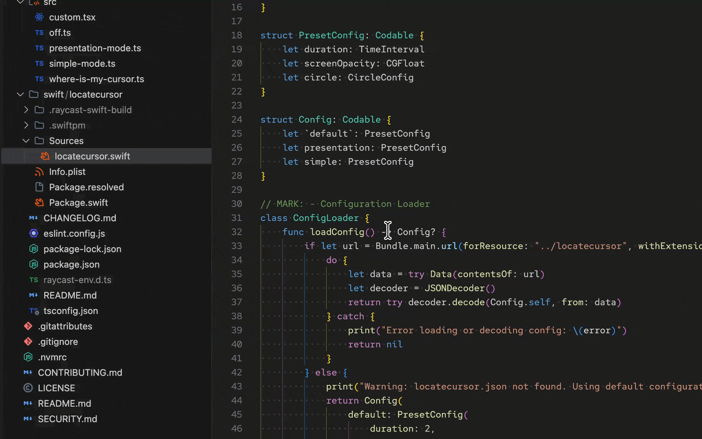
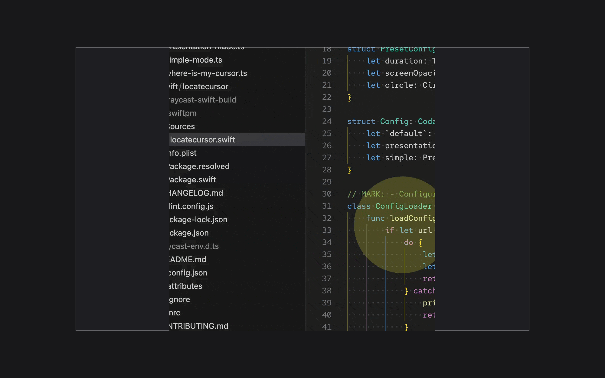
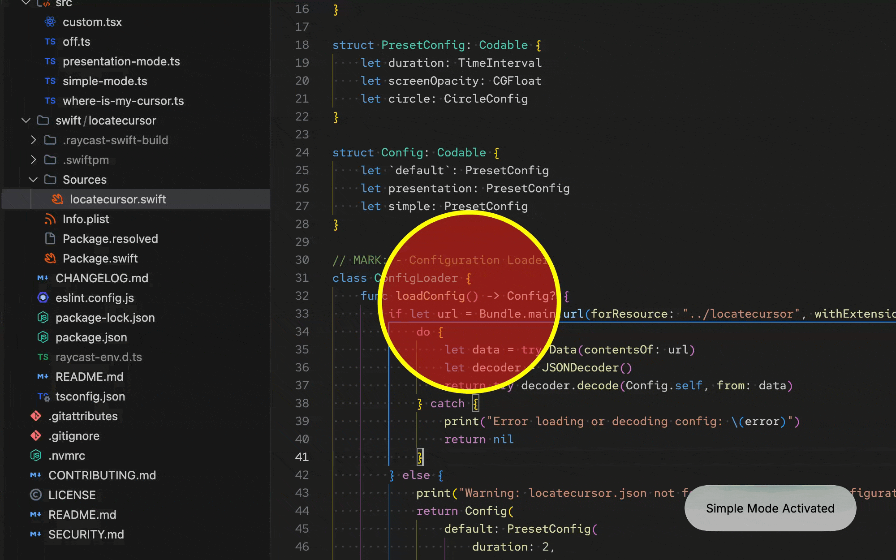

# CHANGES — Raycast Store Review Feedback Resolution

This document describes every problem detected in this fork of
[`where-is-my-cursor`](https://github.com/raycast/extensions/where-is-my-cursor),
how each was solved, and how to reproduce the fixes in the main repository.

Context: the Raycast extension crew reviewed the extension and left two items
of feedback:

> 1. Can we make it compile the binary itself, since you added a new binary in
>    the assets folder, we want to avoid that 🙂
> 2. The README could be a bit more polished about how it works 🙂

---

## Problem 1 — Prebuilt Swift binary shipped with the extension

### Detection

The original submission bundled a compiled `locatecursor` binary under
`assets/`. Raycast does not accept compiled binaries in extension packages;
Swift helpers must ship as **source** and be compiled by Raycast itself.

### Solution

The helper now ships as source only:

```
swift/
└── locatecursor/
    ├── Package.swift          # SPM package, depends on raycast/extensions-swift-tools
    ├── Info.plist
    └── Sources/
        └── locatecursor.swift # full helper implementation (AppKit overlay)
```

Each command imports the function through Raycast's `swift:` protocol:

```ts
import { locatecursor } from "swift:../swift/locatecursor";
```

When `ray build` runs (or the extension is installed from the store), Raycast
detects the `swift:` import and compiles the SPM package automatically. Build
output confirms it:

```
info  - entry points ["src/where-is-my-cursor.ts", ...]
ready - compiling swift package
info  - generated extension's TypeScript definitions
ready - built extension successfully
```

No prebuilt binary exists anywhere in the repository.

### How to reproduce at the main repo

1. Delete any compiled binary committed under `assets/` or elsewhere.
2. Move the helper's Swift sources into `swift/<helper-name>/` as an SPM
   executable target (`Package.swift`, `Sources/*.swift`). If the helper uses
   `@raycast` macros, add the dependency on
   `https://github.com/raycast/extensions-swift-tools`.
3. In every command file, replace whatever invoked the prebuilt binary
   (e.g. `Environment` + `execFile`) with:
   ```ts
   import { locatecursor } from "swift:../swift/locatecursor";
   ```
   where `locatecursor` is the name of the `@raycast`-annotated function.
4. Run `npm run build` and confirm the log contains `compiling swift package`.

---

## Problem 2 — TypeScript cannot resolve the `swift:` import

### Detection

After switching to the `swift:` protocol, `tsc --noEmit` failed on every
command file:

```
error TS2307: Cannot find module 'swift:../swift/locatecursor'
  or its corresponding type declarations.
```

Raycast generates definitions during its own build, but plain `tsc` has no
knowledge of the virtual module.

### Solution

Added a module declaration file, `src/locatecursor.d.ts`:

```ts
declare module "swift:../swift/locatecursor" {
  export function locatecursor(
    arg1: string,
    arg2: string,
    arg3: string,
  ): Promise<void>;
}
```

`tsc --noEmit` now passes.

### How to reproduce

Add a `.d.ts` next to your commands declaring the `swift:` module path exactly
as imported, exporting the `@raycast`-annotated function signature.

---

## Problem 3 — README described an architecture that no longer existed

### Detection

The README claimed:

- A "pre-compiled Swift application located in the extension's assets" — false
  once the binary was removed; would also have failed review.
- Source available at `assets/LocateCursor.swift` — file did not exist.
- Example GIFs referenced `/metadata/default_mode.gif` and
  `/media/presentation_mode.gif` — the `media/` directory did not exist, so one
  image link was broken.

### Solution

README rewritten (`README.md`):

1. **How It Works section replaced.** It now explains:
   - The helper ships as Swift *source* under `swift/locatecursor`.
   - Raycast compiles it automatically via the `swift:` import — no binaries
     bundled, nothing extra to install.
   - The runtime flow: read preset from `assets/locatecursor.json` → create a
     transparent overlay window above the menu bar level on the mouse's screen
     → draw dim layer + spotlight circle centered on the cursor, repaint on
     every mouse move → honor `duration` (`0` = persistent) → lock-file in
     Application Support guarantees a single active instance.
   - Link to the standalone project ([LocateCursor](https://github.com/luciodaou/LocateCursor))
     retained.
2. **Image paths fixed.** All GIF references now point to existing files under
   `metadata/` (the directory Raycast expects):
   ```md
   
   
   
   ```
3. **Extras added:** `<kbd>Esc</kbd>` dismissal note, hex-color support for the
   Custom Mode form, and the build requirement note
   (`xcode-select --install`).

### How to reproduce

Rewrite the README so the architecture description matches the source-shipped
Swift setup, then verify every image path resolves against files actually
committed under `metadata/`.

---

## Problem 4 — Custom Mode rejected persistent duration (behavioral bug)

### Detection

README documented that Custom Mode accepts `Duration = 0` for a *persistent*
highlight, and the Swift helper implements exactly that (`duration > 0`
schedules termination; `0` means never auto-stop). But the form validation in
`src/custom.tsx` rejected zero:

```ts
if (isNaN(duration) || duration <= 0) {
  showFailureToast("Duration must be a positive number.");
  return;
}
```

Users could never create the persistent highlight the docs promised.

### Solution

Relaxed the lower bound to allow zero while still rejecting negatives:

```ts
if (isNaN(duration) || duration < 0) {
  showFailureToast("Duration must be zero (persistent) or a positive number.");
  return;
}
```

### How to reproduce

Align client-side validation with the helper's semantics: `0` is valid
(persistent), negative values are rejected.

---

## Verification performed

| Check | Command | Result |
|---|---|---|
| Type check | `npx tsc --noEmit` | ✅ passes |
| Lint + format | `npm run lint` | ✅ passes |
| Swift compiles standalone | `cd swift/locatecursor && swift build` | ✅ Build complete |
| Full extension build | `npm run build` | ✅ includes `compiling swift package` |
| No binaries in repo | `find . -type f -perm +111` | ✅ none outside `node_modules` |

## Files changed

```
src/custom.tsx         duration validation allows 0 (persistent)
src/locatecursor.d.ts  new: type declaration for swift: import
README.md              rewritten How It Works, fixed image paths
CHANGES.md             this file
```
