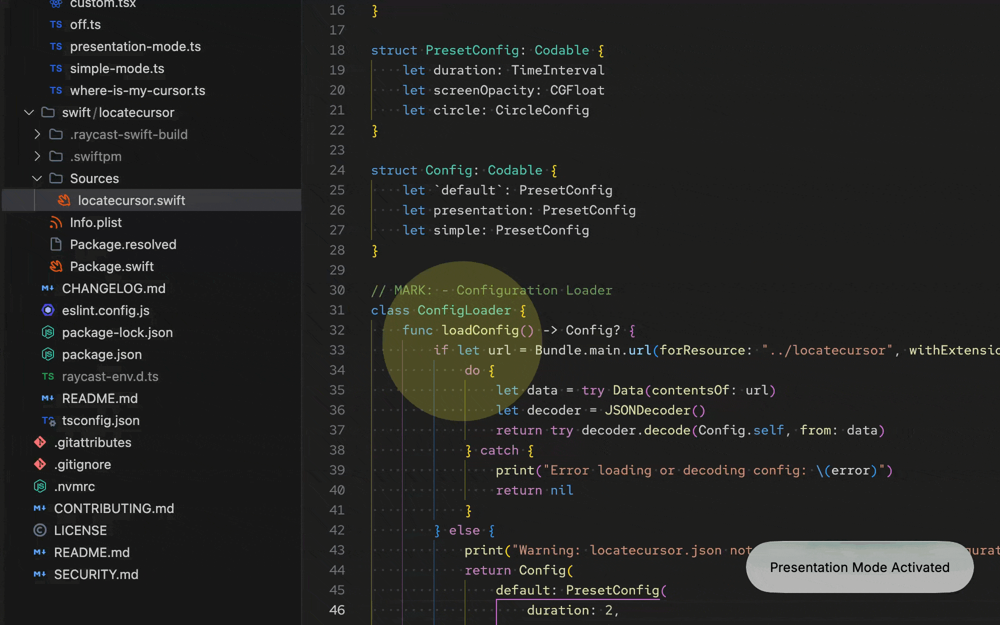

# 🗺️ Where Is My Cursor

Ever lost your cursor in the vast expanse of your multi-monitor setup? 😥 One second it's there, the next it's vanished into the digital abyss. Fear not! This Raycast extension is the trusty sidekick you need to find your elusive pointer in a flash! 🔦

### Default mode

## ✨ Features

This extension comes with a few commands to help you out:

- **Where Is My Cursor:** The main command. Use it to get a quick pulse of light around your cursor. This is the `default` mode.
- **Simple Mode:** A simple visual aid to find the cursor. It shows a red circle with a yellow border around the cursor for 5 seconds.
- **Presentation Mode:** A persistent yellow-tinted circle around your cursor to make it easier to follow during presentations.
- **Custom Mode:** This command opens a form that lets you create a custom, temporary or persistent locator. You can configure things like:
  - Duration (set to 0 for persistent)
  - Screen Opacity
  - Circle Radius, Opacity, and Color (named colors or hex)
  - Border Width and Color (optional)
- **Turn Off Cursor Highlight:** This command immediately stops any running cursor highlight effect.

You can also dismiss any active highlight by pressing <kbd>Esc</kbd>.

## 🕵️ How It Works

The visual effects are produced by a small Swift helper that ships as source code inside this extension (`swift/locatecursor`). Raycast detects the `swift:` import used by the extension's commands and compiles the helper binary automatically when the extension is installed or built — no pre-built binaries are bundled, and nothing extra for you to install.

At runtime, each command calls the compiled helper with a mode and configuration:

1. The helper reads its preset from [`assets/locatecursor.json`](assets/locatecursor.json) (with sensible fallbacks if the file is missing).
2. It creates a transparent overlay window on the screen where the mouse currently lives — at a level just above the menu bar, so it works over full-screen apps.
3. It draws a dimmed layer with a spotlight circle centered on the cursor position, repainting on every mouse move.
4. Depending on the mode's `duration`, the overlay either fades away after N seconds (`0` means persistent) or stays until you run **Turn Off Cursor Highlight** or press <kbd>Esc</kbd>.

A lock-file mechanism in Application Support ensures only one highlight runs at a time — starting a new mode cleanly replaces the previous one.

The helper app is also available as a standalone project at [github.com/luciodaou/LocateCursor](https://github.com/luciodaou/LocateCursor).

> **Note:** Building the extension requires Xcode Command Line Tools (`xcode-select --install`) so Raycast can compile the Swift package.

## 🛠️ Setup

This extension should work right out of the box!

The first time you run a command, macOS might ask for permission to control/accessibility input. This is expected and required for the extension to track mouse movement and dim the screen around your cursor.

## 🔒 Privacy

This extension works completely offline and does not collect, store, or transmit any user data. Your privacy is safe and sound. 🛡️

## 🖼️ Examples

### Presentation mode

### Custom mode

---

Icon from <a href="https://www.flaticon.com/free-icons/helper" title="helper icons">Helper icons created by Fathema Khanom - Flaticon</a>

## ❤️ Support

If you find this extension useful, consider donating to support its development. Thank you!

