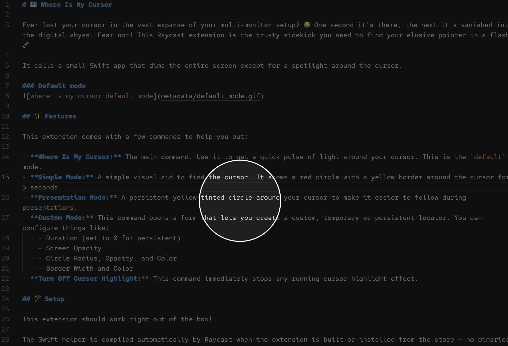
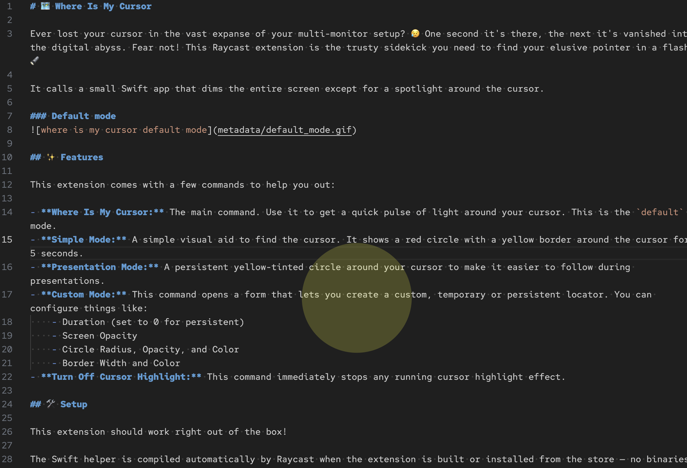
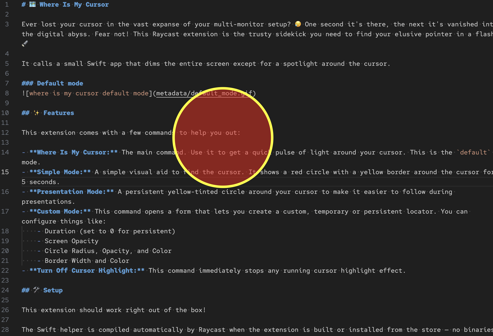

# 🗺️ Where Is My Cursor

Ever lost your cursor in the vast expanse of your multi-monitor setup? 😥 One second it's there, the next it's vanished into the digital abyss. Fear not! This Raycast extension is the trusty sidekick you need to find your elusive pointer in a flash! 🔦

It calls a small Swift app that dims the entire screen except for a spotlight around the cursor.

### Default mode


## ✨ Features

This extension comes with a few commands to help you out:

- **Where Is My Cursor:** The main command. Use it to get a quick pulse of light around your cursor. This is the `default` mode.
- **Simple Mode:** A simple visual aid to find the cursor. It shows a red circle with a yellow border around the cursor for 5 seconds.
- **Presentation Mode:** A persistent yellow-tinted circle around your cursor to make it easier to follow during presentations.
- **Custom Mode:** This command opens a form that lets you create a custom, temporary or persistent locator. You can configure things like:
    - Duration (set to 0 for persistent)
    - Screen Opacity
    - Circle Radius, Opacity, and Color
    - Border Width and Color
- **Turn Off Cursor Highlight:** This command immediately stops any running cursor highlight effect.

## 🛠️ Setup

This extension should work right out of the box!

The Swift helper is compiled automatically by Raycast when the extension is built or installed from the store — no binaries are bundled, and nothing extra needs to be installed. 

## 🏗️ Build 

If you want to build locally yourself, make sure you have the Xcode Command Line Tools installed:

```
xcode-select --install
```

The first time you run a command, macOS might ask for permission to Raycast control the screen. This is expected and required for the extension to be able to dim the screen and highlight your cursor.

## 🕵️ How It Works

This extension uses a small Swift helper that ships as **source** under `swift/locatecursor` (an SPM package). Raycast detects the `swift:` import used by the commands and compiles the package automatically — there are no prebuilt binaries in this repository.

At runtime, the helper:

1. Reads the preset configuration (mode, duration, circle style, etc.).
2. Creates a transparent overlay window above the menu bar level on the screen where the mouse currently is.
3. Draws a dimming layer plus a spotlight circle centered on the cursor, repainting on every mouse move.
4. Honors the configured `duration` (`0` means the highlight stays persistent until turned off).
5. Uses a lock file in Application Support so only one highlight instance runs at a time — running it again replaces the active one.

Press <kbd>Esc</kbd> while the form is open to cancel Custom Mode; use **Turn Off Cursor Highlight** to stop any running effect.

The helper is also available as a standalone project at [github.com/luciodaou/LocateCursor](https://github.com/luciodaou/LocateCursor).

Custom Mode accepts hex colors for both the circle and its border:

## 🔒 Privacy

This extension works completely offline and does not collect, store, or transmit any user data.

## 🖼️ Examples

### Presentation mode


### Custom mode


---

Icon from <a href="https://www.flaticon.com/free-icons/helper" title="helper icons">Helper icons created by Fathema Khanom - Flaticon</a>

## ❤️ Support

If you find this extension useful, consider donating to support its development. Thank you!

[](https://ko-fi.com/luciodaou)