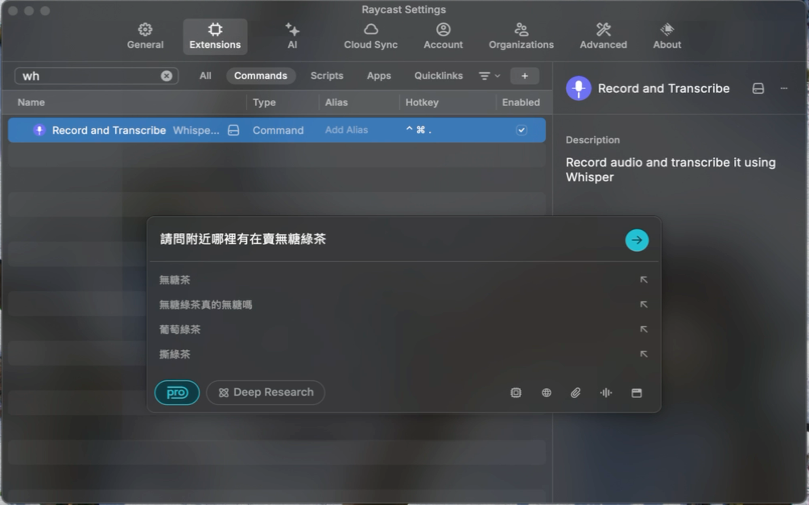

# Whisper Voice Input

A Raycast extension that records audio, transcribes it using whisper-cpp, and pastes the transcribed text back into your active application.



---

## ⚡️ Requirements

- macOS (Apple Silicon recommended; see Troubleshooting for Intel Macs)
- [Raycast](https://www.raycast.com/) installed
- Homebrew package manager
- Required Homebrew packages: `ffmpeg`, `whisper-cpp`, `terminal-notifier`, `cliclick`
- Whisper model file (see below)

---

## ✨ Features

- Record audio for a specified duration
- Transcribe audio using OpenAI's Whisper model via whisper-cpp
- Support for multiple languages
- Automatic UTF-8 encoding handling
- Seamless integration with Raycast
- One-click paste functionality

---

## 🚀 Installation

1. **Install Raycast** if you haven't already:  
   [Download Raycast](https://www.raycast.com/)

2. **Install required dependencies via Homebrew:**
   ```bash
   brew install ffmpeg whisper-cpp terminal-notifier cliclick
   ```

3. **Download a Whisper model:**
   ```bash
   mkdir -p ~/whisper-models
   # Small model (1GB) - Faster, less accurate
   curl -L -o ~/whisper-models/ggml-small.bin \
     https://huggingface.co/ggerganov/whisper.cpp/resolve/main/ggml-small.bin

   # Medium model (1.5GB) - Balanced speed and accuracy (default)
   curl -L -o ~/whisper-models/ggml-medium.bin \
     https://huggingface.co/ggerganov/whisper.cpp/resolve/main/ggml-medium.bin

   # Large model (3GB) - Slower, more accurate
   curl -L -o ~/whisper-models/ggml-large.bin \
     https://huggingface.co/ggerganov/whisper.cpp/resolve/main/ggml-large.bin
   ```

4. **Install from Raycast Store**
   - Open Raycast
   - Go to Extensions
   - Search for "Whisper Voice Input"
   - Click Install

---

## 🛠 Usage

1. Open Raycast
2. Search for "Whisper Voice Input"
3. Press Enter to start recording
4. The extension will:
   - Record audio for the specified duration
   - Transcribe the audio using whisper-cpp
   - Paste the transcribed text back into your active application

📺 Watch the demo on YouTube: [Whisper Voice Input Demo](https://youtu.be/C_h3kMNlO6o?si=EVAk0pVZsIC5Ib0B)

---

## ⚙️ Configuration

The shell script (`assets/whisper-voice-input.sh`) supports the following parameters:
- `-d`: Recording duration in seconds (default: 5)
- `-l`: Language code (default: "en")
- `-m`: Path to model file (default: "~/whisper-models/ggml-medium.bin")
- `-t`: Temporary directory
- `-s`: Sender bundle ID

**To customize defaults:**  
Edit `assets/whisper-voice-input.sh` directly.

**Example configurations:**
```bash
# Use small model
./assets/whisper-voice-input.sh -m ~/whisper-models/ggml-small.bin

# Use large model with 10-second recording
./assets/whisper-voice-input.sh -m ~/whisper-models/ggml-large.bin -d 10

# Use medium model with English language
./assets/whisper-voice-input.sh -m ~/whisper-models/ggml-medium.bin -l en
```

---

## 🧑‍💻 Development

This extension is distributed via the Raycast Store. For development or contributions, please fork the repository on GitHub and follow the contribution guidelines in the repository.

---

## 📝 How it Works

- When you run the command, the extension records audio from your microphone.
- The audio is transcribed using the Whisper model via `whisper-cpp`.
- The transcribed text is automatically pasted into your active application using `cliclick`.

---

## 🩹 Troubleshooting

- **Missing commands:**  
  If you see errors about missing `ffmpeg`, `whisper-cpp`, or `cliclick`, make sure they are installed via Homebrew and available at `/opt/homebrew/bin/`.  
  If you are on an Intel Mac, adjust the script paths from `/opt/homebrew/bin/` to `/usr/local/bin/` as needed.

- **Changes not picked up:**  
  If changes to the shell script or assets are not picked up, try quitting and restarting Raycast.

- **Accessibility permissions:**  
  Make sure Raycast has Accessibility permissions (for `cliclick` and AppleScript).

- **Audio device issues:**  
  If recording fails, check your microphone permissions and that the correct input device is selected.

---

## 🔍 Error Handling & User Guidance

- **External Dependencies:**  
  This extension relies on external tools (`ffmpeg`, `whisper-cpp`, `terminal-notifier`, `cliclick`). If you encounter errors, ensure these are installed and accessible in your PATH.  
  - For Apple Silicon Macs, check `/opt/homebrew/bin/`.  
  - For Intel Macs, check `/usr/local/bin/`.

- **Whisper Model Issues:**  
  Ensure the Whisper model file is correctly downloaded and placed in `~/whisper-models/`. If transcription fails, verify the model file integrity and permissions.

- **Permission Issues:**  
  If the extension fails to record audio or paste text, verify that Raycast has the necessary permissions (microphone and accessibility).

- **Logs and Debugging:**  
  Check the Raycast logs for detailed error messages. If issues persist, consider enabling verbose logging in the extension settings.

---

## 📄 License

This project is licensed under the MIT License - see the [LICENSE](LICENSE) file for details.

Key features of the MIT License:
- Commercial use
- Modification
- Distribution
- Private use

For more information about the MIT License, visit [choosealicense.com/licenses/mit/](https://choosealicense.com/licenses/mit/). 