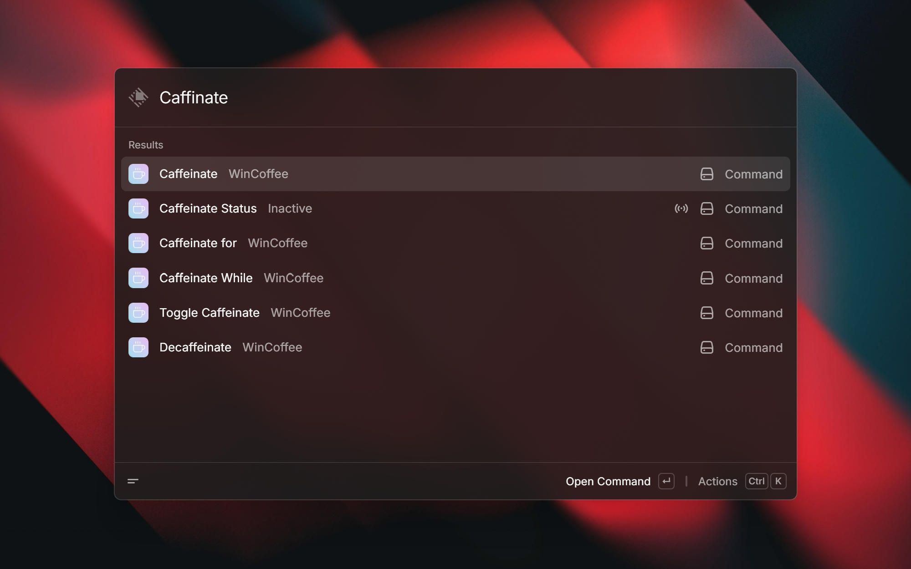

# WinCoffee

WinCoffee is a Raycast extension designed specifically for Windows users to prevent their PC from going to sleep designed to mirror the macOS "Coffee" extension.

## Commands

  

- **Caffeinate**: Turn on indefinite caffeination.
- **Decaffeinate**: Turn off caffeination and restore default power management settings.
- **Toggle Caffeinate**: Toggle caffeination on or off.
- **Caffeinate for**: Select a preset duration (or enter a custom one) to keep your PC awake.
- **Caffeinate While**: Select from a list of active applications/processes to keep your PC awake until the process finishes.
- **Toggle Lid Sleep**: Toggle whether closing the laptop lid puts the computer to sleep.
- **Enable Lid Sleep / Disable Lid Sleep**: Enable or disable sleep action when the laptop lid is closed.
- **Lid Sleep Status**: View and change current lid sleep settings for AC and DC power schemes.
- **Caffeinate Status**: Background command that updates the active caffeination state and shows remaining time.

## Configuration (Preferences)

- **Display Settings - Keep display awake**: Prevent the screen from turning off while caffeinated. (Default: `true`)
- **Lid Settings - Ignore closing the lid**: Prevent the computer from sleeping when the lid is closed while caffeinated. (Default: `false`)

## Acknowledgements

- Inspiration from macOS [Coffee](https://www.raycast.com/mooxl/coffee) extension by [mooxl](https://github.com/mooxl).
- Icon designed using [Feather Icons](https://feathericons.com) (licensed under MIT).
