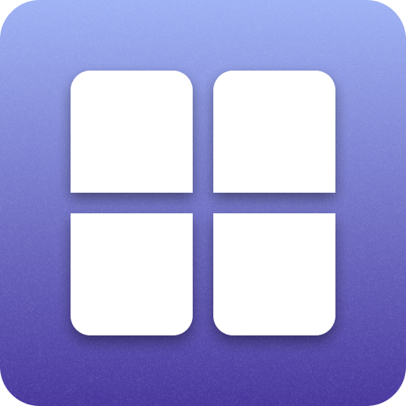

    

# Window Layouts

### 🙌 Requires Raycast PRO

This extension takes X amount of open windows and tiles them into a chosen layout. Affected amount of windows depends on each individual layout.

You can choose a gap in extension settings that is applied between and around the windows.

> **NOTE!** This extension is **NOT** an automatic tiling window manager. Layout is only applied when the command is run from Raycast. At least one window must have focus when running a command.

## Commands

- **Grid Layout**: Tiles windows into a grid layout.
- **Horizontal 1-2**: Tiles windows into a horizontal layout with 1 large window and 2 smaller windows.
- **Horizontal 3**: Tiles windows into a horizontal layout with 3 equal-sized windows.
- **Horizontal 30-70**: Tiles windows into a horizontal layout with 30% and 70% sized windows.
- **Horizontal 50-50**: Tiles windows into a horizontal layout with 50% sized windows.
- **Horizontal 70-30**: Tiles windows into a horizontal layout with 70% and 30% sized windows.
- **Vertical 1-2**: Tiles windows into a vertical layout with 1 large window and 2 smaller windows.
- **Vertical 2-1**: Tiles windows into a vertical layout with 2 smaller windows and 1 large window.
- **Vertical 3**: Tiles windows into a vertical layout with 3 equal-sized windows.
- **Vertical 30-70**: Tiles windows into a vertical layout with 30% and 70% sized windows.
- **Vertical 50-50**: Tiles windows into a vertical layout with 50% sized windows.
- **Vertical 70-30**: Tiles windows into a vertical layout with 70% and 30% sized windows.

