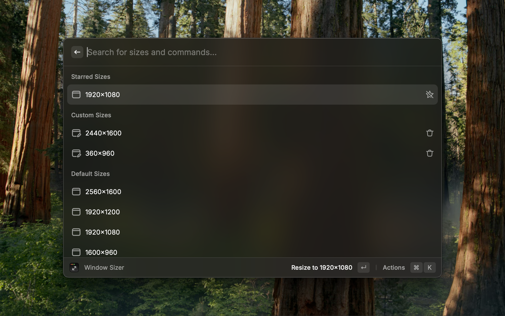

  

&nbsp;

# Window Sizer

Resize application windows to pixel-perfect presets.

## Features

This extension uses Swift to interact with windows, providing the following features:

- Quickly resize windows to predefined sizes
- Create and save custom window sizes
- Star your frequently used window sizes
- Maximize window
- Restore previous window size
- Get current window size

## Usage

Search for the following command in Raycast:

- `Window Sizer` or `Resize Window` - Open the window size selector

## Shortcuts

- `⌘ S` - Star window size
- `⇧ ⌘ S` - Unstar window size
- `⌘ D` - Delete custom window size

## Notes

- To resize windows, please allow Raycast to control your Mac under System Settings → Privacy & Security → Accessibility
- Some applications may restrict window resizing
