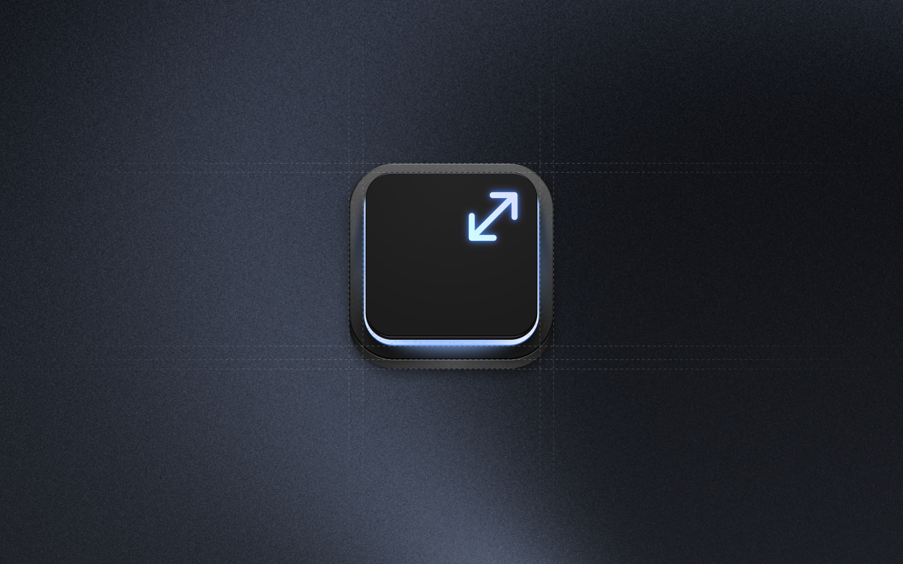
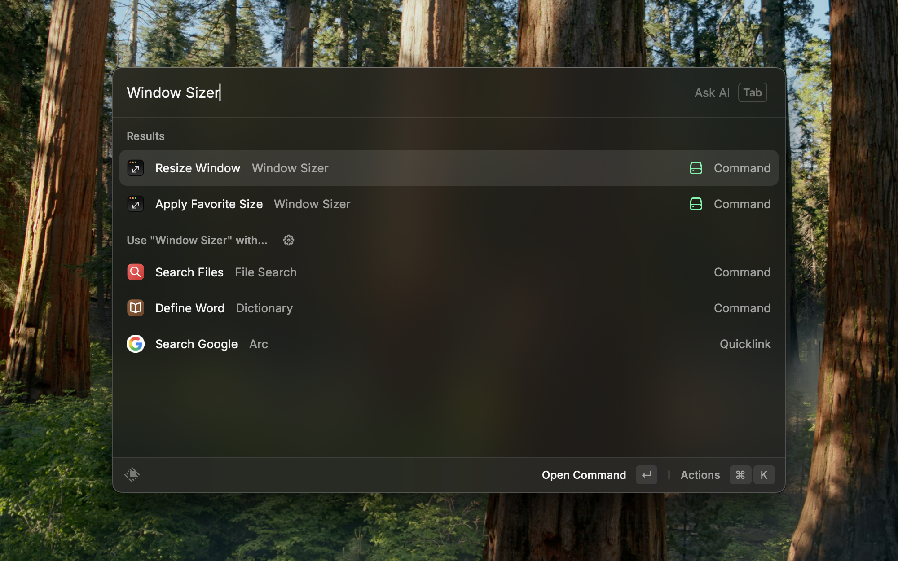
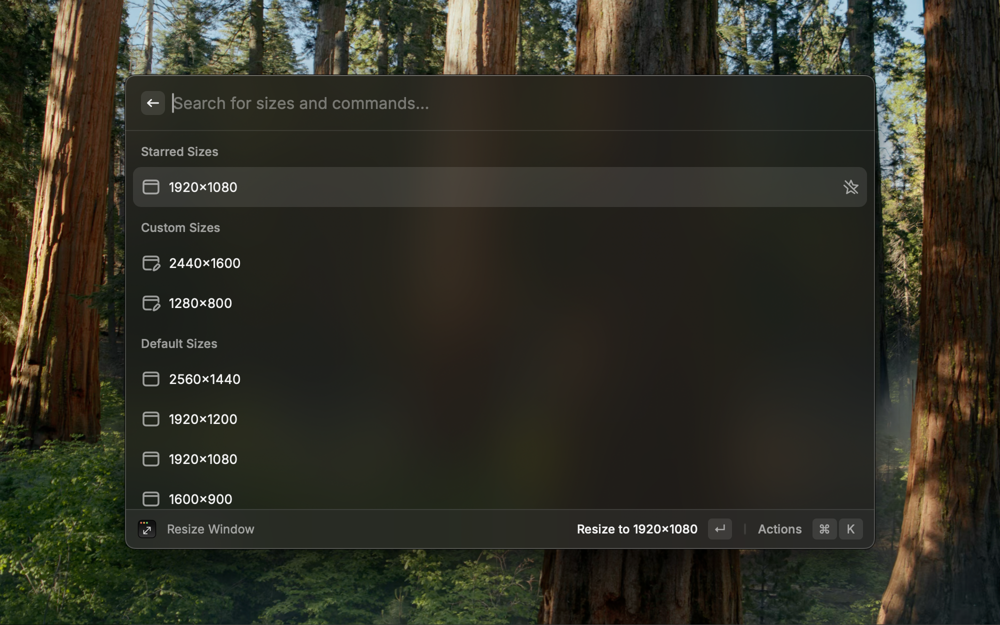
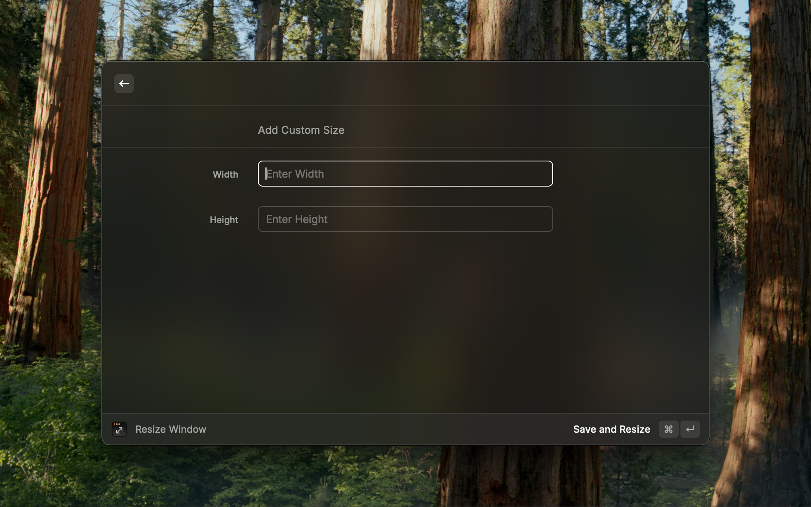
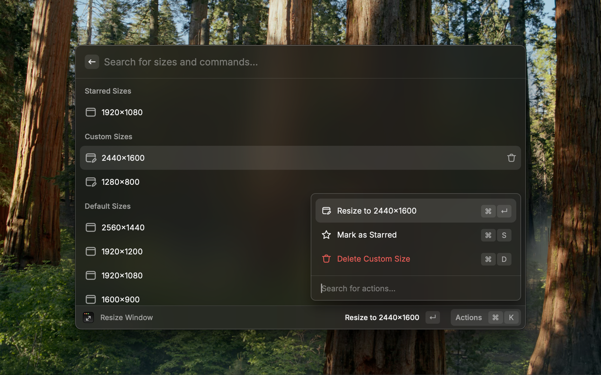
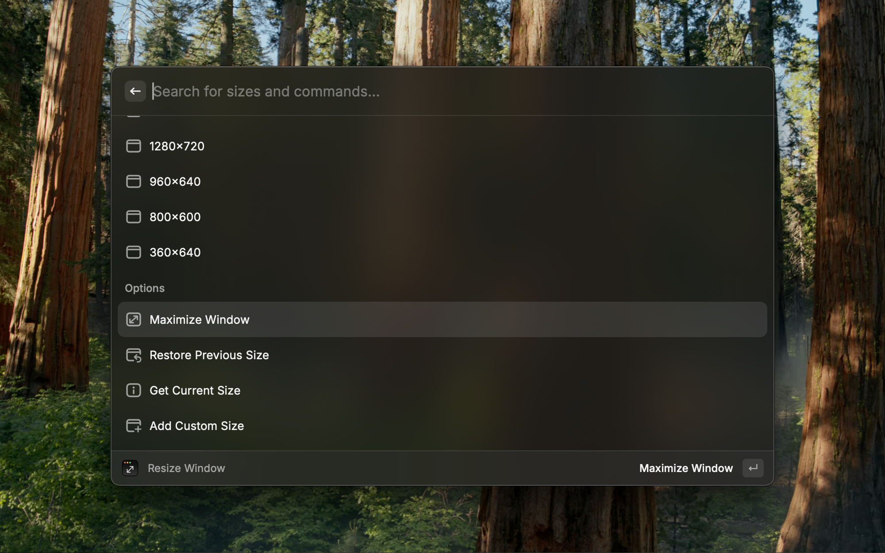
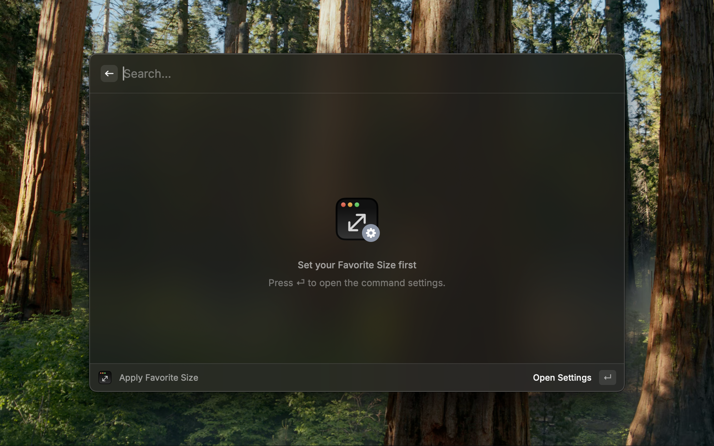
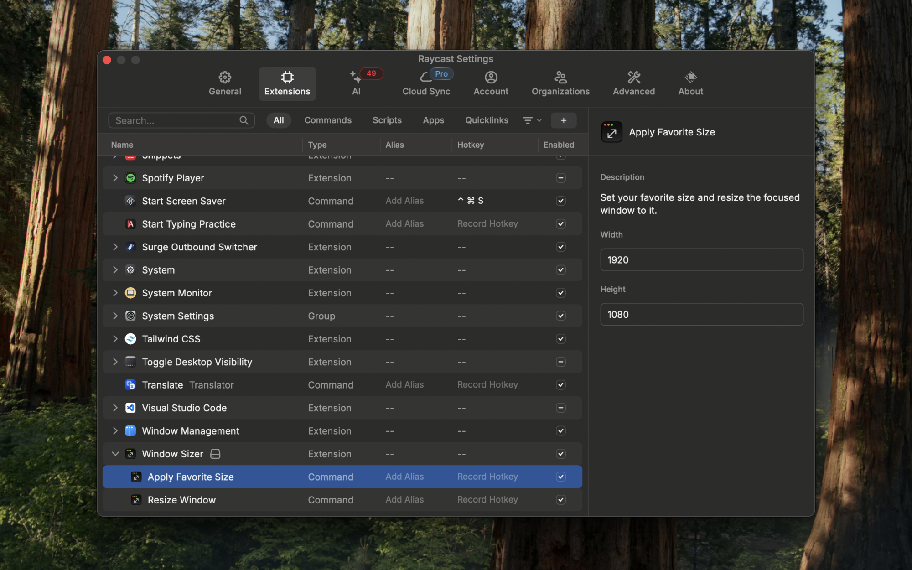

  

&nbsp;

# Window Sizer

Resize the focused window to pixel-perfect presets.

## Usage and Features

### Search commands

- `Window Sizer`
- `Resize Window`
- `Apply Favorite Size`

  

---

### Resize Window

#### Quickly resize a window to predefined sizes

  

#### Add and save custom window sizes

  

#### Star your frequently used window sizes

  

#### Other options

- Maximize window
- Restore previous window size
- Get current window size

  

---

### Apply favorite size

Set the size in the command settings before using this command.

  

  

## Shortcuts

- `⌘ S` - Star window size
- `⇧ ⌘ S` - Unstar window size
- `⌘ D` - Delete custom window size

## Notes

- To resize windows, please allow Raycast to control your Mac under System Settings → Privacy & Security → Accessibility
- Some applications may restrict window resizing
