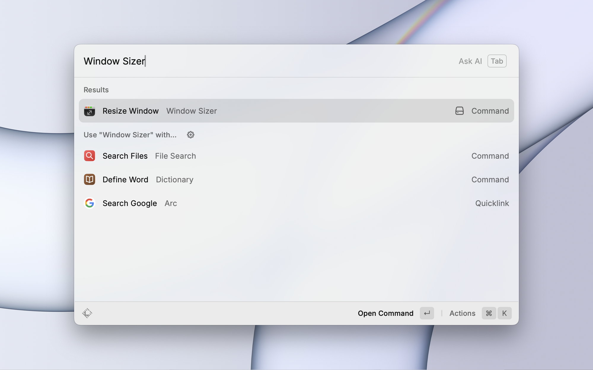
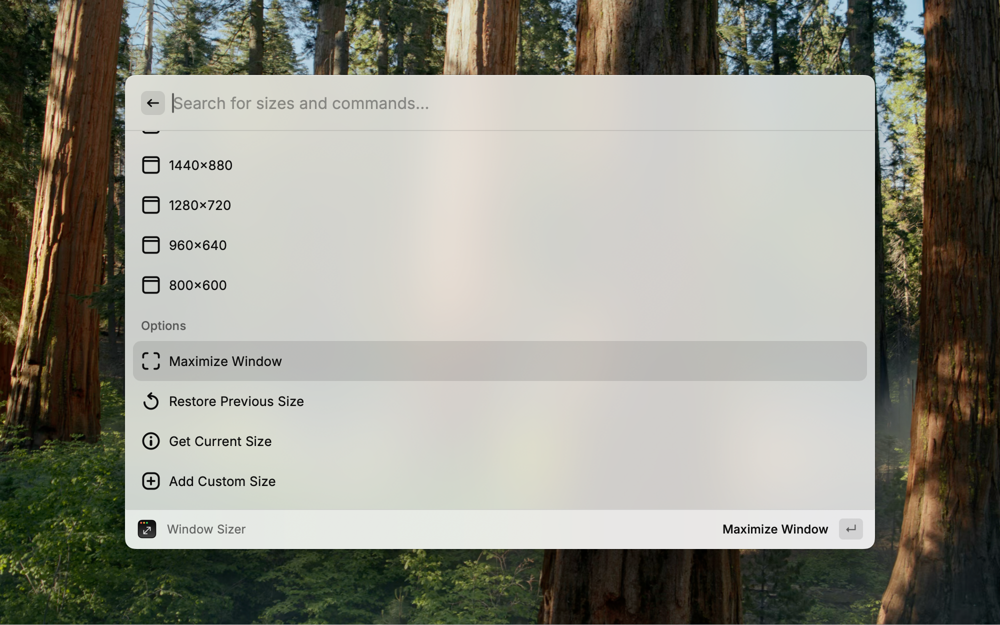
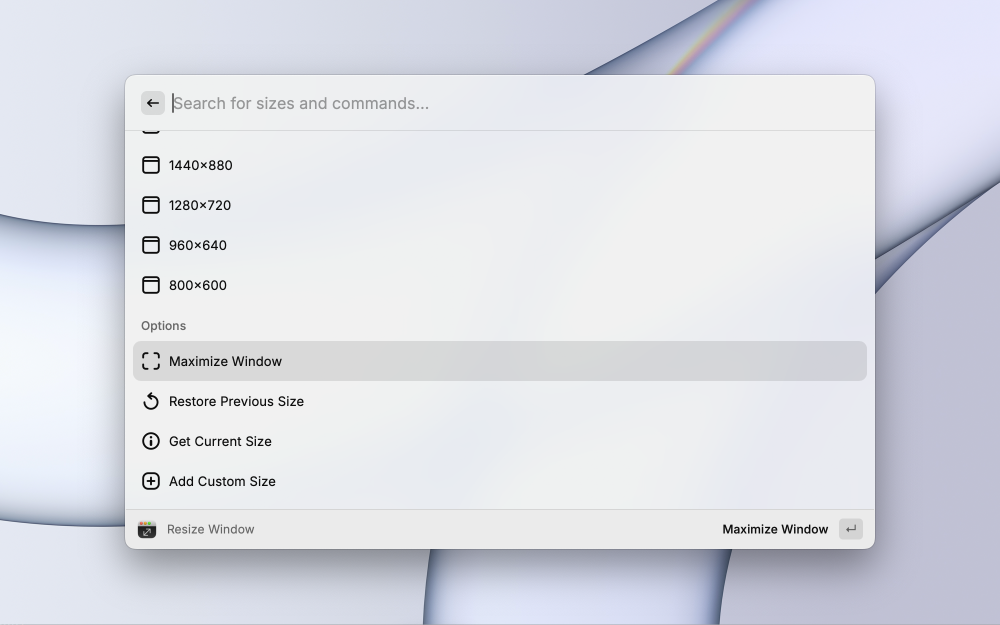
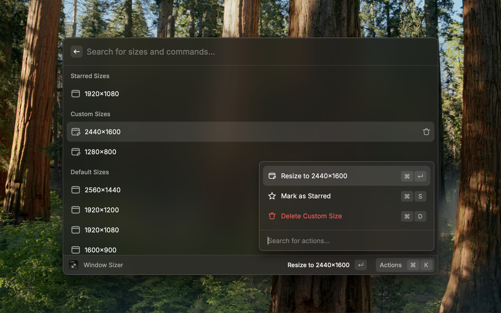
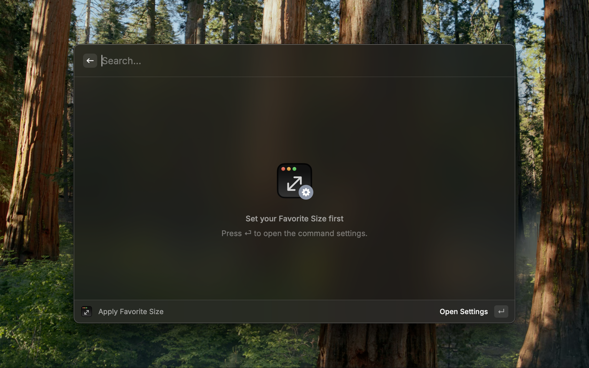

  

<h1 align="center">Window Sizer</h1>

Resize the focused window to pixel-perfect presets

 

## Features

### Resize Window

- Quickly resize a window to predefined sizes
- Add and save custom window sizes
- Star your frequently used window sizes
- Maximize window
- Restore previous window size
- Get current window size

-

### Apply favorite size

To use this feature, set your favorite size in the command settings.

 

## Shortcuts

- `⌘ S` - Star window size
- `⇧ ⌘ S` - Unstar window size
- `⌘ D` - Delete custom window size

 

## Notes

- To resize windows, please allow Raycast to control your Mac under `System Settings` → `Privacy & Security` → `Accessibility`
- Some applications may restrict window resizing
