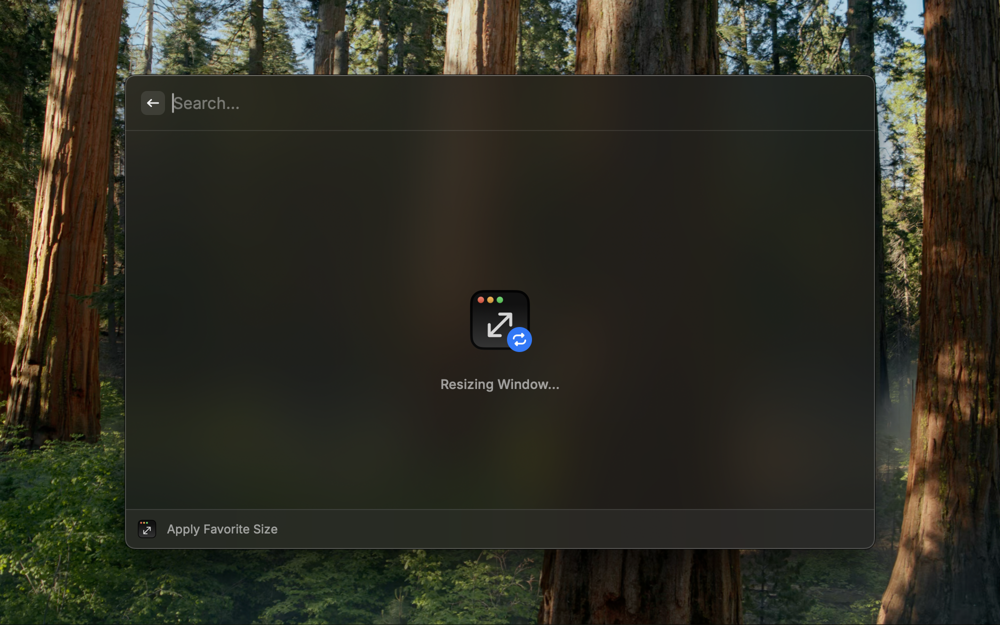

  

<h1 align="center">Window Sizer</h1>

Resize the focused window to pixel-perfect presets

  

 

## Features

### Resize Window

#### Quickly resize a window to predefined sizes

  

#### Add and save custom window sizes

  

#### Star your frequently used window sizes

  

#### Other options

- Maximize window
- Restore previous window size
- Get current window size

  

---

### Apply favorite size

#### Applying when size is not set

  

#### Set favorite size in the command settings

  

#### Resizing to favorite size

  

## Shortcuts

- `⌘ S` - Star window size
- `⇧ ⌘ S` - Unstar window size
- `⌘ D` - Delete custom window size

## Notes

- To resize windows, please allow Raycast to control your Mac under `System Settings` → `Privacy & Security` → `Accessibility`
- Some applications may restrict window resizing
