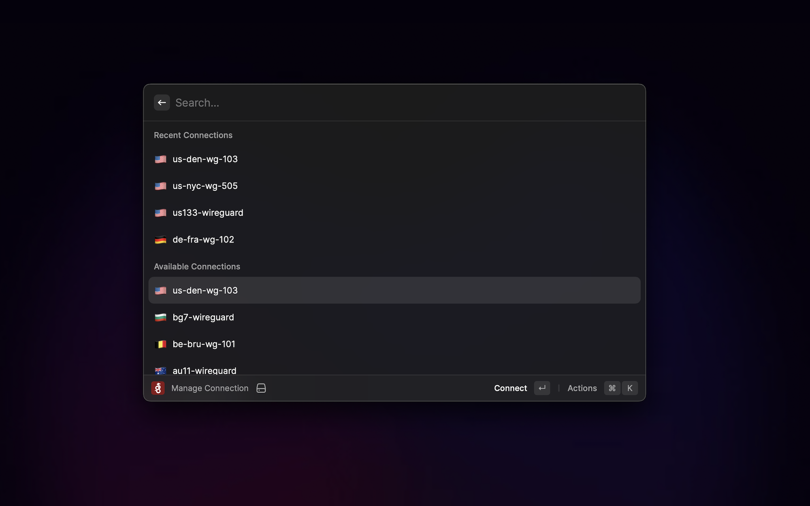

# WireGuard Manager

Manage WireGuard Connections

## Remarks

The flags are parsed from the tunnel name itself.
As long as the tunnel name starts with like country code with a dash, the flag will be shown, example `US-Home` or `FR-Work`.
