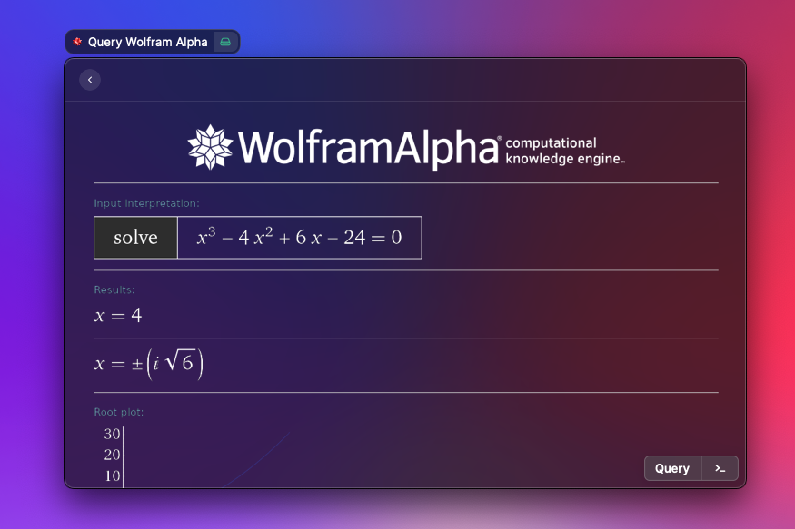

# Wolfram Alpha

_Query Wolfram Alpha right from Raycast_

## Create an App ID

- Sign in the [Wolfram Alpha Developer Program](https://developer.wolframalpha.com/portal/)
- Go to the My Apps tab
- Click on the "Get an AppID" button
- Enter `Raycast Extension` as the title and `Query Wolfram Alpha from Raycast` as the description
- Copy the generated AppID into the Raycast preferences

