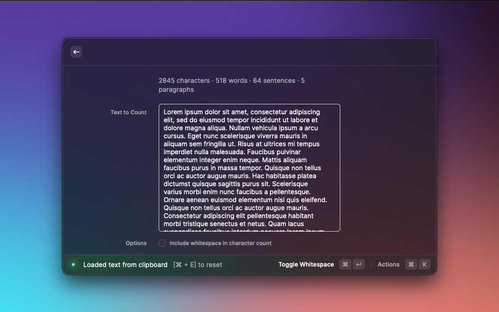

# Word Count

Count the number of characters, words, sentences, and paragraphs in some text.

## Tips

- The command will automatically count any text in your clipboard. To clear, use `⌘ + E`.
- Whitespace is ignored by default when counting characters. To toggle whitespace counting, use `⌘ + W`.

## Screenshot

