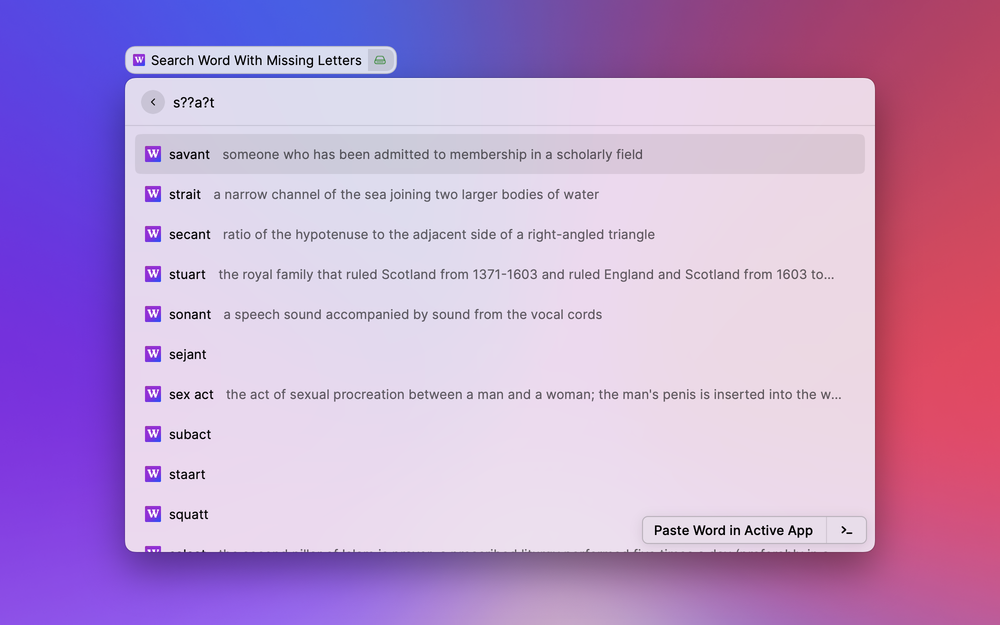
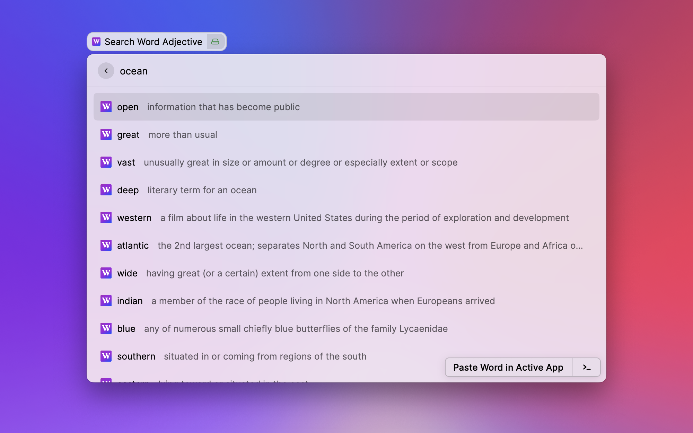
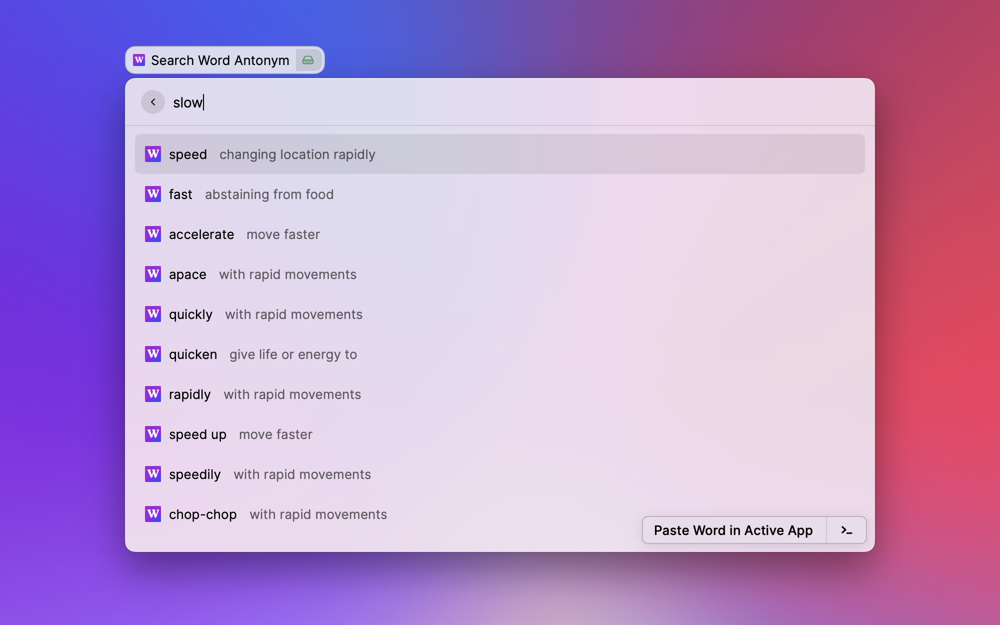
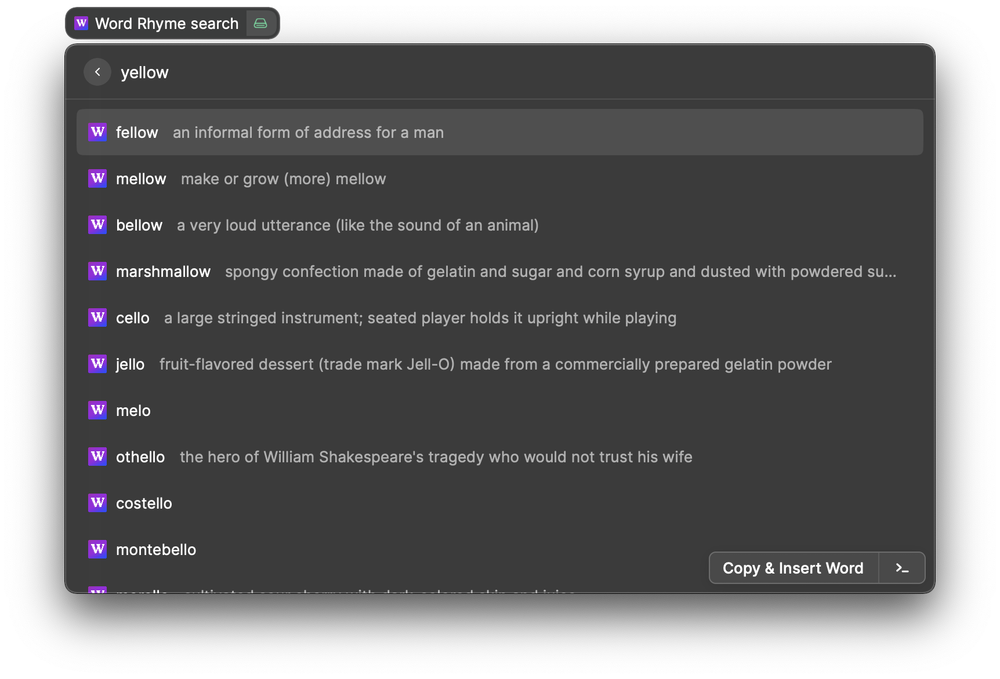
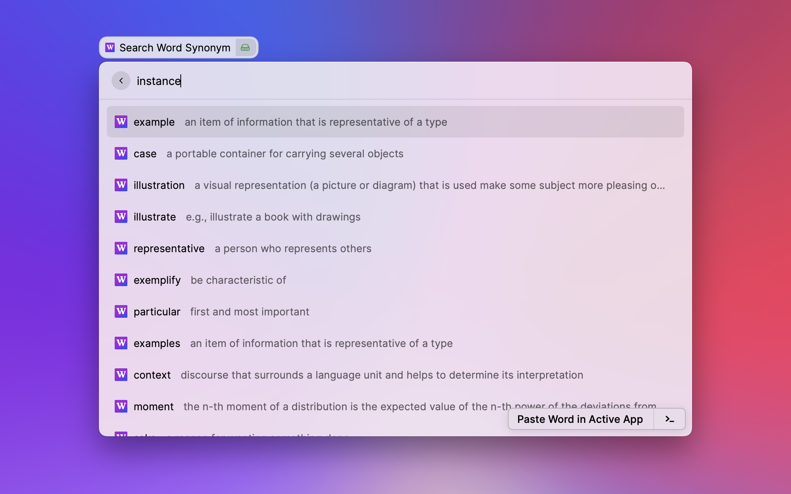

# Word Search for Raycast

Search for synonyms, antonyms, adjectives, rhymes, and words with missing letters using Raycast!

### How to search using Word Search
Once you've entered your text, just hit `return` on your keyboard to insert it in the foremost as well as copy it ot your clipboard.

### How to search for Words With Missing Letters

To search for missing letters, place `?` between the letters you are unsure about. 
For example, in the picture above, `s??a?t` means search for a word, 6 characters in length, where we don't know 3 of the letters in **those** positions where the `?` is.

Likewise, if you enter `he??o`, it will show all the combination of five-letter words with `he` in the beginning and `o` at the end.

*But no cheating in Wordle!*

## Word Search in Action

