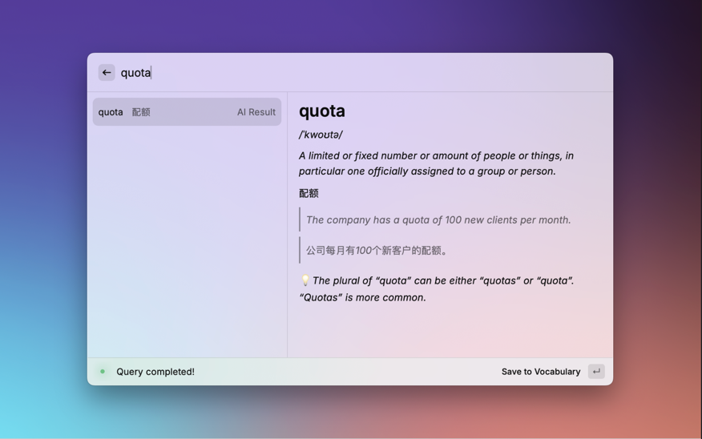

# Word4You Raycast Extension

Raycast extension for quick/enriched UI interaction with the word4you CLI.

## Features

- 🚀 **Quick Launch**: Get instant explanations with keyboard shortcuts
- 🌍 **Multilingual Support**: Query words, phrases, and sentences in English, Chinese, or mixed languages
- 🔄 **Bi-directional Translation**: Seamless translation between Chinese and English
- 🤖 **Dual AI Providers**: Support for both Google Gemini and Qwen APIs
- 📝 **Smart Classification**: Automatically detects input type (word/phrase/sentence) and language
- 😻 **Rich UI**: Beautiful interface with better UX compared to CLI
- 🔊 **CRUD Management**: Complete management of your markdown vocabulary notebook

## Screenshot

## Setup

1. Install the extension in Raycast
    - Run `cd word4you-extension-raycast`
    - Run `npm install` to install the required dependencies
    - Run `npm run dev` to start the Raycast development server and open the extension in Raycast
2. Select your preferred AI provider (Google Gemini or Qwen) in the extension preferences
3. Enter your API key for the selected provider
4. Start using the extension to search for words

## Requirements

- Raycast
- Node.js
- Either a Gemini API key or Qwen API key
- Git(Optional)

## Functionality

1. **Query Explanations**: Support for words, phrases, and sentences in multiple languages
2. **Language Detection**: Automatically detects English, Chinese, or mixed-language input
3. **Bi-directional Translation**: Translate between Chinese and English seamlessly
4. **Save to Vocabulary**: Store structured explanations in your markdown notebook
5. **Update Explanations**: Refresh saved entries with new AI-generated content
6. **Delete Entries**: Remove words from your vocabulary notebook
7. **Provider Selection**: Choose between Gemini and Qwen AI providers
