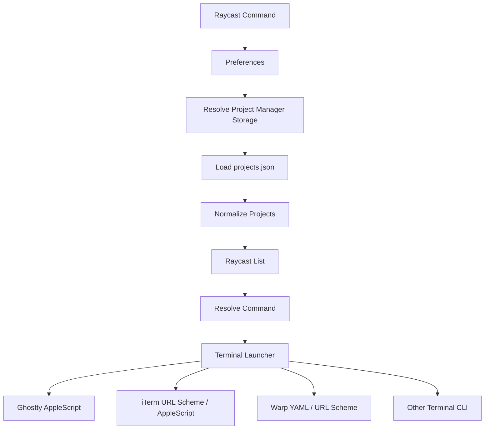

# Workspace Terminal Design

## 目的

Workspace Terminal は、VS Code Project Manager のプロジェクト一覧を Raycast から検索し、選択したプロジェクトを任意のターミナルで開いて、必要に応じて起動コマンドを実行する Raycast 拡張として実装する。

方式は以下の実績実装を優先して採用する。

- Project Manager 設定・データ読み込み: `raycast/extensions` の `visual-studio-code-project-manager` at `b8c8fcd7ebd441a5452b396923f2a40e879565ba`
- Ghostty / iTerm / Warp などのターミナル起動: `raycast/extensions` の `code-runway` at `870667fc671801a467deb7c4c7fc72992efe3820`

## 基本方針

1. Project Manager のデータ取得は、既存 Raycast 拡張と同じく VS Code アプリ選択から storage path を導出する。
2. ターミナル起動は、シェル文字列連結ではなく `execFile` の配列引数、AppleScript、URL Scheme、YAML 生成をターミナルごとに使い分ける。
3. `CONCEPT.md` のアイデアは維持しつつ、実績実装と矛盾する箇所は実績方式を優先する。
4. エラー状態は Toast だけで隠さず、Raycast の `Detail` / `List.EmptyView` / metadata でユーザーが設定値を確認できるようにする。

## 全体構成



## Preferences

### Project Manager

Project Manager の保存場所は、`visual-studio-code-project-manager` 拡張と同じ考え方で解決する。

| Name | Type | Required | Default | Purpose |
|---|---|---:|---|---|
| `vscodeApp` | `appPicker` | No | `/Applications/Visual Studio Code.app` | 対象 VS Code アプリ。Stable / Insiders / 派生エディタの storage path 導出に使う。 |
| `projectManagerDataPath` | `directory` | No | empty | Project Manager data directory の上書き。 |
| `hideProjectsNotEnabled` | `checkbox` | No | `false` | `enabled: false` のプロジェクトを非表示にする。 |
| `hideProjectsWithoutTag` | `checkbox` | No | `false` | タグなしプロジェクトを非表示にする。 |
| `groupProjectsByTag` | `checkbox` | No | `true` | タグ単位でセクション表示する。 |

### Terminal

| Name | Type | Required | Default | Purpose |
|---|---|---:|---|---|
| `terminalType` | `dropdown` | Yes | `ghostty` | 起動先ターミナル。 |
| `defaultCommand` | `textfield` | No | empty | 全プロジェクト共通の起動コマンド。 |
| `commandMode` | `dropdown` | No | `keepShell` | `none` / `commandOnly` / `keepShell`。 |
| `reuseWindow` | `checkbox` | No | `false` | 既存インスタンス再利用。ターミナルごとの capability により best-effort。 |
| `shellPath` | `textfield` | No | `/bin/zsh` | `keepShell` で使う shell。 |

`reuseWindow` は全ターミナルで同じ意味を持たないため、内部では terminal capability として扱う。

```ts
type ReuseSupport = "none" | "bestEffort" | "requiresUserSetup" | "supported";
```

非対応ターミナルで `reuseWindow` が有効な場合、黙って無視せず Toast で理由を通知する。

## Project Manager データ解決

### デフォルトパス

`visual-studio-code-project-manager` の実績方式に合わせ、選択された VS Code アプリ名から短縮名を作る。

```ts
const vscodeAppNameShort = vscodeApp.name.replace(/^Visual Studio /, "");
const storagePath = `${homedir()}/Library/Application Support/${vscodeAppNameShort}/User/globalStorage/alefragnani.project-manager`;
```

例:

| App name | Storage |
|---|---|
| `Visual Studio Code` | `~/Library/Application Support/Code/User/globalStorage/alefragnani.project-manager` |
| `Visual Studio Code - Insiders` | `~/Library/Application Support/Code - Insiders/User/globalStorage/alefragnani.project-manager` |

### 上書きパス

`projectManagerDataPath` が設定されている場合は次の順で扱う。

1. 未設定ならデフォルト storage path を使う。
2. 存在しない場合はエラー状態として `Detail` に表示する。
3. ディレクトリならそのまま使う。
4. ファイルなら `dirname(path)` を使う。
5. それ以外はエラー状態にする。

例外を上位へ投げるより、`{ path, error }` を返して UI で説明する方式にする。

### 読み込み対象

初期実装では `projects.json` を主データソースとする。

```text
<storagePath>/projects.json
```

将来拡張として、`visual-studio-code-project-manager` が扱う cache files も取り込めるように loader を分離する。

```text
<storagePath>/projects_cache_git.json
<storagePath>/projects_cache_any.json
<storagePath>/projects_cache_vscode.json
```

cache files を使う場合は、`projects.json` を優先し、`rootPath === fullPath` の重複は skip する。

## Project 型と正規化

```ts
interface ProjectEntry {
  id?: string;
  name: string;
  rootPath: string;
  paths?: string[];
  tags?: string[];
  enabled?: boolean;
  profile?: string;
}

interface NormalizedProject {
  id: string;
  name: string;
  rootPath: string;
  cwd: string;
  tags: string[];
  enabled: boolean;
  isRemote: boolean;
  exists: boolean;
}
```

正規化ルール:

1. `name` または `rootPath` が空の項目は除外する。
2. `enabled` は未指定なら `true` として扱う。
3. `hideProjectsNotEnabled` が有効なら `enabled === false` を除外する。
4. `~` と `$home` は `homedir()` に展開する。
5. `.code-workspace` はターミナル cwd にできないため `dirname(rootPath)` を `cwd` にする。
6. `vscode-remote://` などローカル cwd にできないパスは `isRemote = true` とし、Terminal 起動アクションを無効化する。
7. `existsSync(cwd)` が false の場合は一覧には出すが警告 accessory を表示する。

## List UI

`visual-studio-code-project-manager` の UI 方針を踏襲する。

- `title`: project name
- `subtitle`: `tildify(dirname(cwd))`
- `icon`: `{ fileIcon: cwd }`
- `keywords`: tags
- `accessories`: tags、missing path warning、remote warning

検索は Raycast の default filtering でも実装可能だが、Project Manager 拡張の実績に合わせるなら `filtering={false}` として以下を組み合わせる。

1. `useFrecencySorting(projects, { key: (p) => p.rootPath })`
2. 未訪問項目は `name.localeCompare`
3. 検索文字列を `a.*b.*c` 形式へ変換する fuzzy matching
4. 完全一致、部分一致を優先表示

タググルーピングは、タグなしを `[no tags]` セクションへ入れる。複数タグを持つプロジェクトは複数セクションに出ることを許容する。

## Error UI

Project Manager の設定や読み込みに関するエラーは `Detail` で表示する。

表示内容:

- Markdown body: 問題と対応方法
- Metadata:
  - VS Code App
  - Project Manager Data Path
  - Resolved Storage Path
  - Expected `projects.json`

開発時のみ `environment.isDevelopment` で debug actions を表示する。

- Open projects.json in VS Code
- Show data directory in Finder
- Copy data path

## Command 解決

起動コマンドは次の優先順位で決定する。

1. プロジェクト個別 override
2. `defaultCommand`
3. empty

プロジェクト個別 override は `LocalStorage` に JSON 文字列として保存する。

```ts
type ProjectCommandOverrides = Record<string, string>;
```

キーは `rootPath` を基本にする。同名プロジェクトが存在するため `name` はキーにしない。

## Command Mode

```ts
type CommandMode = "none" | "commandOnly" | "keepShell";
```

| Mode | Behavior |
|---|---|
| `none` | ターミナルを cwd で開くだけ。 |
| `commandOnly` | command をそのまま実行する。終了後の shell 維持はしない。 |
| `keepShell` | `command; exec <shell>` として、コマンド終了後も shell を残す。 |

`keepShell` の `;` は意図的に使う。`&&` にするとコマンド失敗時に shell が残らないため。

## 共通エスケープ

`code-runway` の方式を採用する。

```ts
export function shellQuote(value: string): string {
  return "'" + value.replace(/'/g, "'\\''") + "'";
}

export function shellCd(dir: string): string {
  return `cd -- ${shellQuote(dir)}`;
}
```

AppleScript に入れる文字列は別レイヤーで escape する。

```ts
function toAppleScriptString(value: string): string {
  const parts = value.replace(/\r\n/g, "\n").split("\n");
  const escaped = parts.map((part) => `"${part.replace(/\\/g, "\\\\").replace(/"/g, '\\"')}"`);
  return escaped.join(" & linefeed & ");
}
```

YAML は手書きテンプレートではなく `js-yaml` の `dump(config, { noRefs: true })` で生成する。

## Terminal Launcher 抽象

対象ターミナルが多いため、`code-runway` の実装方式を参考にしつつ、本拡張では adapter interface を採用する。

```ts
interface LaunchRequest {
  project: NormalizedProject;
  cwd: string;
  command: string | null;
  commandMode: CommandMode;
  reuseWindow: boolean;
  shellPath: string;
}

interface TerminalLauncher {
  type: TerminalType;
  reuseSupport: ReuseSupport;
  checkInstalled(): Promise<boolean>;
  launch(req: LaunchRequest): Promise<void>;
}
```

`supportsDynamicCommand` のような単純 boolean は使わない。Warp のように「YAML なら可能、URI なら不可」という条件があるため、各 launcher 内で処理する。

## Ghostty 方式

`CONCEPT.md` の `open -na Ghostty.app --args --working-directory=... -e ...` ではなく、`code-runway` の Ghostty AppleScript 方式を採用する。

理由:

- working directory を `surface configuration` に設定できる。
- new window / tab / split など Ghostty の UI 構造を制御できる。
- command auto run を `input text` + `send key "enter"` として明示的に扱える。

基本フロー:

1. `which ghostty`
2. 見つからなければ `/Applications/Ghostty.app`
3. 見つからなければ `~/Applications/Ghostty.app`
4. `pgrep -x Ghostty` で起動中か確認
5. `osascript` で Ghostty AppleScript を実行

AppleScript の概念:

```applescript
tell application "Ghostty"
  activate
  set cfgRoot to new surface configuration
  set initial working directory of cfgRoot to "<cwd>"
  set rootWindow to new window with configuration cfgRoot
  set rootTerminal to focused terminal of selected tab of rootWindow
  input text "<command>" to rootTerminal
  send key "enter" to rootTerminal
end tell
```

コマンド自動実行は `command` が空でない場合のみ行う。将来的に `ghosttyAutoRun` のような専用 preference を追加する余地は残すが、初期実装では `commandMode !== "none"` と command の有無で制御する。

`reuseWindow` は Ghostty AppleScript で既存ウィンドウやタブを扱える範囲で best-effort とする。CLI の `ghostty +new-window` は macOS 向け方式として採用しない。

## iTerm 方式

`code-runway` と同じく、まず URL Scheme を試し、失敗時に AppleScript fallback を使う。

Primary:

```text
iterm2:/command?c=<encodeURIComponent(command)>&d=<encodeURIComponent(cwd)>
```

コマンドなし:

```text
iterm2:/command?d=<encodeURIComponent(cwd)>
```

Fallback:

```applescript
tell application "iTerm"
  activate
  create window with default profile
  tell current session of current window
    write text "cd -- '<cwd>' && clear && <command>"
  end tell
end tell
```

AppleScript fallback では `shellCd(cwd)` と AppleScript string escape を必ず適用する。

## Warp 方式

### Command なし

YAML を作らず、Warp URI を使う。

```text
warp://action/new_window?path=<encodeURIComponent(cwd)>
```

`reuseWindow` が有効な場合は `new_tab` を使う。

```text
warp://action/new_tab?path=<encodeURIComponent(cwd)>
```

### Command あり

`code-runway` と同じく `~/.warp/launch_configurations/` に YAML を生成する。

```ts
const config = {
  name: `workspace-terminal__${safeName}_${Date.now()}`,
  windows: [
    {
      tabs: [
        {
          layout: {
            cwd,
            commands: [{ exec: command }],
          },
        },
      ],
    },
  ],
};
```

`commands` は `layout` の中に置く。

起動:

```text
warp://launch/<encodeURIComponent(config.name)>
```

Fallback:

1. URL Scheme
2. `open -a Warp`
3. `which warp` が通る場合は `warp launch <name>`

古い一時 YAML は同じ prefix を起動前に削除する。

## Other Terminal 方式

### Alacritty

`execFile` 配列引数で起動する。

```text
alacritty --working-directory <cwd> -e <shell> -lc <command>
```

`-e` 以降は command args として扱われるため、追加オプションは必ず `-e` より前に置く。

`reuseWindow` は非対応。

### WezTerm

既存インスタンス再利用を試みる場合:

```text
wezterm cli spawn --cwd <cwd> --new-window -- <shell> -lc <command>
```

失敗時:

```text
wezterm start --cwd <cwd> -- <shell> -lc <command>
```

### kitty

新規起動:

```text
kitty --directory <cwd> -e <shell> -lc <command>
```

既存インスタンス再利用:

```text
kitten @ launch --cwd <cwd> <shell> -lc <command>
```

`kitten @` は remote control 設定が必要なため、失敗時は新規起動に fallback し、Toast で `allow_remote_control` が必要であることを案内する。

## インストール検出

`code-runway` の方式を拡張して、次の順で検出する。

1. CLI: `which <command>`
2. `/Applications/<App>.app`
3. `~/Applications/<App>.app`

未検出の場合は起動アクションを無効化し、`Toast.Style.Failure` で案内する。

アプリのアイコンは app bundle が見つかる場合 `{ fileIcon: bundlePath }` を使う。

## 二重起動防止

`code-runway` と同様に、module scope に直近起動情報を保持する。

```ts
const LAUNCH_DEDUP_MS = 1200;
let lastLaunch: { projectPath: string; at: number } | undefined;
```

同じ `projectPath` が 1200ms 以内に再実行された場合は skip する。

## Action 設計

Primary action:

- Open in Terminal

Secondary actions:

- Open without Command
- Set Project Command
- Clear Project Command
- Copy Path
- Open in VS Code
- Show in Finder

Project が remote の場合:

- Terminal 起動は無効化
- VS Code remote open は将来対応として分離

Project の cwd が存在しない場合:

- Terminal 起動は確認なしでは実行しない
- Show in Finder は無効化
- Copy Path は可能

## 実装ファイル構成

```text
src/
  open-workspace.tsx
  types.ts
  preferences.ts
  project-manager/
    load-projects.ts
    normalize-project.ts
    resolve-storage.ts
  storage/
    command-overrides.ts
  terminal/
    index.ts
    types.ts
    detect.ts
    shell-quote.ts
    launchers/
      ghostty.ts
      iterm.ts
      warp.ts
      terminal-app.ts
      alacritty.ts
      wezterm.ts
      kitty.ts
  ui/
    extension-error.tsx
    project-list-item.tsx
```

## 依存関係

```json
{
  "dependencies": {
    "@raycast/api": "latest",
    "js-yaml": "^4.1.0",
    "tildify": "^2.0.0"
  },
  "devDependencies": {
    "@raycast/eslint-config": "latest",
    "@types/js-yaml": "^4.0.9",
    "@types/node": "latest",
    "@types/react": "latest",
    "typescript": "latest"
  }
}
```

`shell-quote` は追加せず、`code-runway` と同等の `shellQuote` を自前実装する。

## CONCEPT.md からの変更点

| Area | CONCEPT.md | Design.md |
|---|---|---|
| Project Manager path | 固定候補中心 | VS Code appPicker から storage path を導出 |
| Project Manager cache | 未考慮 | 将来拡張として `projects_cache_*.json` を取り込める構成 |
| Ghostty | `open -na ... --args` / `+new-window` | Ghostty AppleScript API を採用 |
| iTerm | AppleScript 中心 | URL Scheme primary、AppleScript fallback |
| Warp | 手書き YAML | `js-yaml` で生成、`commands` は `layout` 内 |
| Escaping | `shellQuote` が未定義 | `shellQuote`, `shellCd`, AppleScript string escape を明示 |
| Reuse Window | boolean | terminal capability に基づく best-effort |
| Install Detection | 未整理 | `which` → `/Applications` → `~/Applications` |
| Duplicate launch | 未整理 | 1200ms dedup |

## 参考実装

- `extensions/visual-studio-code-project-manager/src/search-project-manager-projects.tsx`
  - VS Code app から storage path を導出
  - `projectManagerDataPath` の防御的解決
  - `Detail` + metadata のエラー表示
  - Frecency sorting / fuzzy search / tag grouping
- `extensions/visual-studio-code-project-manager/src/types.ts`
  - Project entry / Preferences 型
- `extensions/code-runway/src/utils/ghosttyLauncher.ts`
  - Ghostty AppleScript API
  - 多行対応 AppleScript string escape
- `extensions/code-runway/src/utils/itermLauncher.ts`
  - iTerm URL Scheme primary + AppleScript fallback
- `extensions/code-runway/src/utils/warpLauncher.ts`
  - `js-yaml` による Warp Launch Configuration 生成
  - URL Scheme / `open -a Warp` / `warp launch` fallback
- `extensions/code-runway/src/utils/shellQuote.ts`
  - `shellQuote` / `shellCd`
- `extensions/code-runway/src/utils/terminalIcons.ts`
  - app bundle 検出と fileIcon
- `extensions/code-runway/src/search-projects.tsx`
  - terminal dispatch
  - launch dedup
