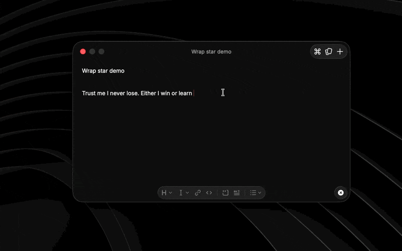

# Wrap Star

A Raycast extension that wraps your currently selected text with a delimiter pair and pastes it back **in place** — no copy/paste dance, no leaving the app you're in.

Select `Hello`, fire a command, and it becomes `(Hello)`.



## Supported pairs

| Pair | Example |
| --- | --- |
| Parentheses `( )` | `Hello` → `(Hello)` |
| Single quotes `' '` | `Hello` → `'Hello'` |
| Double quotes `" "` | `Hello` → `"Hello"` |
| Square brackets `[ ]` | `Hello` → `[Hello]` |
| Curly braces `{ }` | `Hello` → `{Hello}` |
| Angle brackets `< >` | `Hello` → `<Hello>` |

## Commands

| Command | What it does |
| --- | --- |
| **Wrap Selection (Default)** | Wraps with your configured default pair. This is the one to bind to a global hotkey for one-press wrapping. |
| **Wrap Selection with…** | Opens a list so you can pick any pair on the fly. |
| **Wrap with Parentheses / Single Quotes / Double Quotes / Square Brackets / Curly Braces / Angle Brackets** | Six instant commands — one per pair — so each can have its own dedicated hotkey. |

Each command has its own icon so it's easy to spot in Raycast's root search.

## Usage

1. Select some text in any app.
2. Trigger a wrap command — via Raycast search, or (recommended) a hotkey.
3. The selection is replaced in place with the wrapped version.

If nothing is selected, the extension shows a brief **"No text selected"** message and does nothing else. Wrapping itself is silent — no success toast.

### Set your default pair

The **Wrap Selection (Default)** command uses a configurable pair. To change it:

**Raycast Settings → Extensions → Wrap Star → Wrap Selection (Default)** → set **Default Pair** (defaults to Parentheses).

### Assign hotkeys

In the same settings panel, give any command a **Hotkey**. The intended workflow is to bind **Wrap Selection (Default)** to a single shortcut — then with text selected, one keypress wraps it. You can also bind individual per-pair commands to their own shortcuts if you switch pairs often.

## How it works

Each command calls a shared helper ([`src/lib/wrap.ts`](src/lib/wrap.ts)) that:

1. Reads the current selection with Raycast's `getSelectedText()`.
2. Wraps it as `open + text + close`.
3. Pastes the result back over the selection with `Clipboard.paste()`.

> **Requires Accessibility permission.** Reading and replacing the selection relies on Raycast having macOS Accessibility access (**System Settings → Privacy & Security → Accessibility**). If a wrap command appears to do nothing, check this first.

## Development

```sh
npm install
npm run dev      # builds and imports the extension into Raycast (hot-reloads on save)
npm run build    # production build
npm run lint     # lint + manifest/icon validation
npm run fix-lint # auto-fix lint issues
```

`npm run dev` requires being signed into Raycast.

### Project structure

```
.
├── package.json              # manifest: commands, preferences, icons
├── src/
│   ├── lib/wrap.ts           # shared WRAPPERS table + wrapSelection() helper
│   ├── wrap-default.ts       # default command (reads the Default Pair preference)
│   ├── wrap-with.tsx         # list picker
│   └── wrap-<pair>.ts        # six per-pair commands
└── assets/
    ├── extension-icon.png    # extension icon
    └── icon-<pair>.png       # per-command icons
```

### Adding a new pair

1. Add an entry to `WRAPPERS` in [`src/lib/wrap.ts`](src/lib/wrap.ts) (`open`, `close`, `title`, `icon`).
2. Add a 512×512 PNG to `assets/`.
3. Add a `src/wrap-<pair>.ts` command that calls `wrapSelection("<key>")`.
4. Register the command (and its `icon`) in `package.json`, and add it to the `defaultWrapper` dropdown options.

### Editing icons

Icons are 512×512 transparent PNGs in `assets/`, referenced per command in `package.json`. Replace a file to change its artwork. Raycast caches icons by filename — if an updated icon doesn't appear, restart `npm run dev`, fully quit and relaunch Raycast, or rename the asset (and its reference) to cache-bust.

## License

MIT
