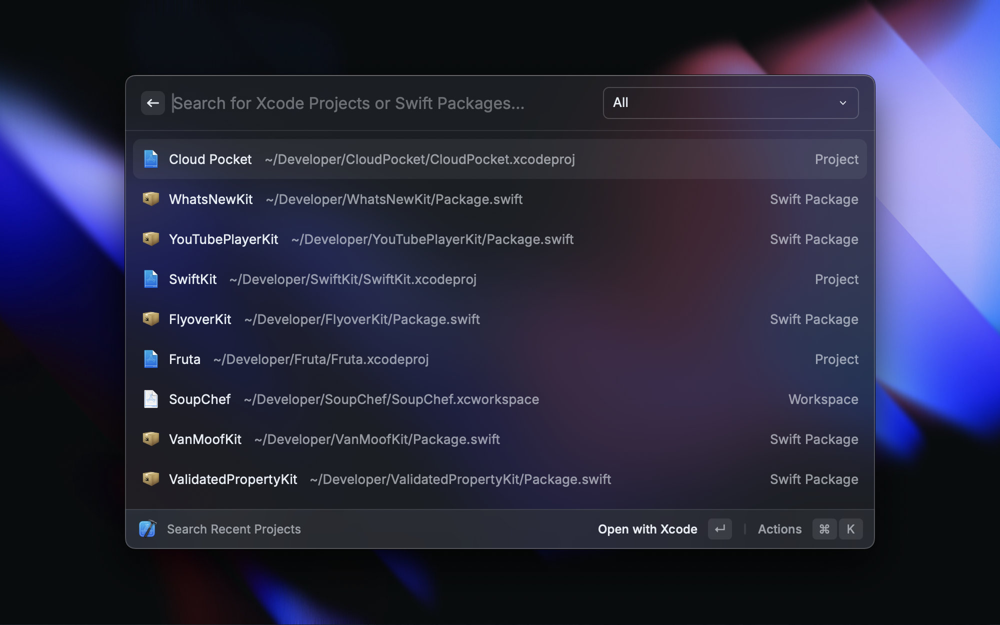

    

<h1 align="center">Xcode Extension for Raycast</h1>

    Search and open your recent Xcode Projects, manage your Simulators & Apps, 
     
    create Swift Packages & Playgrounds and quickly clear Xcode cache files.

