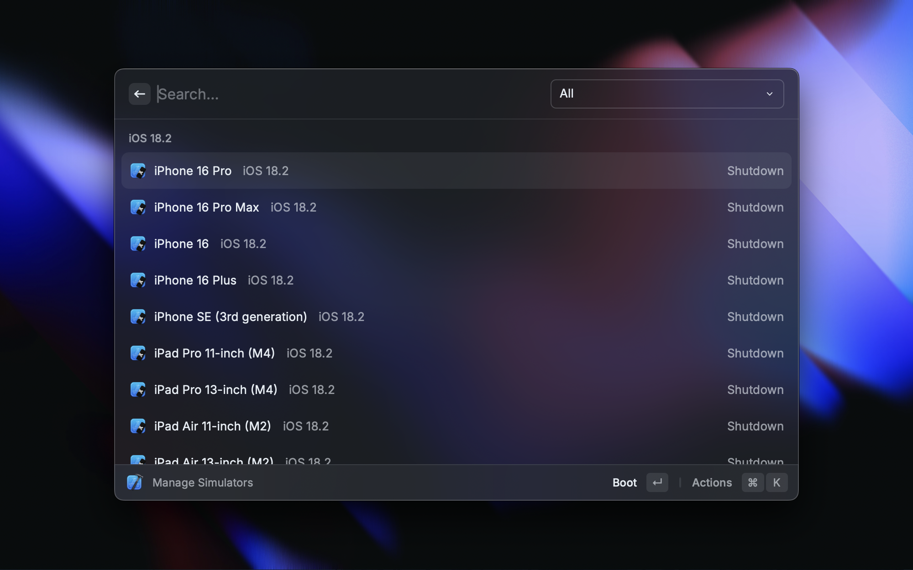
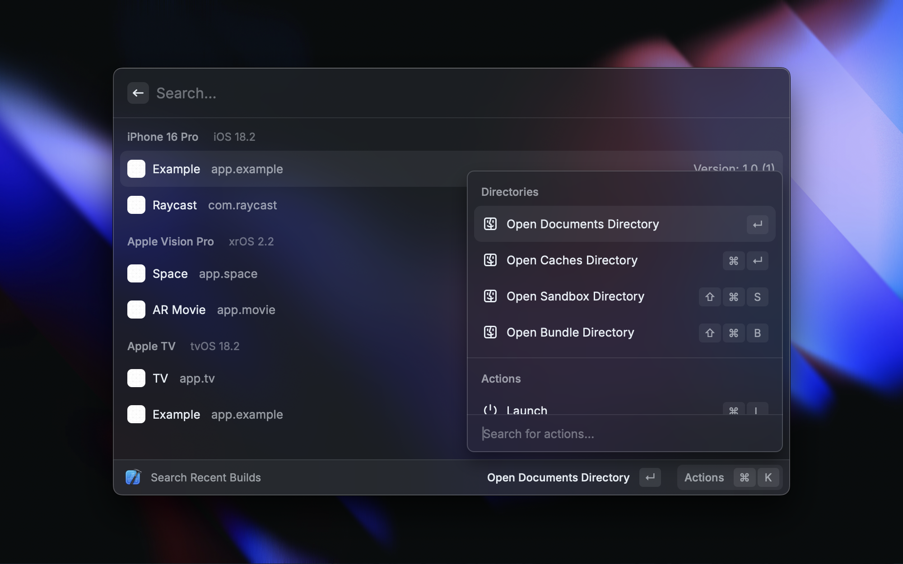
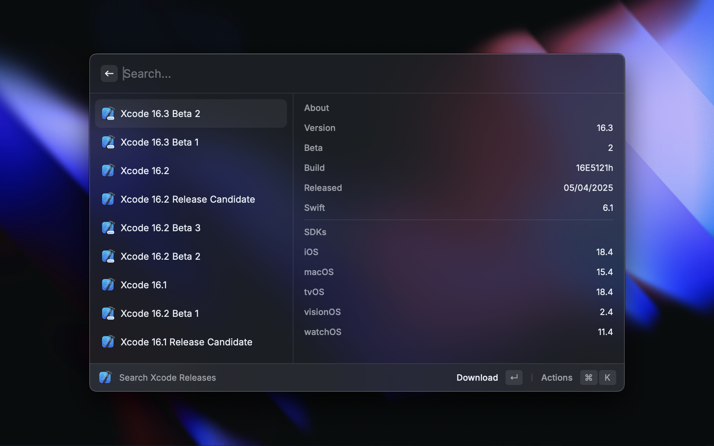
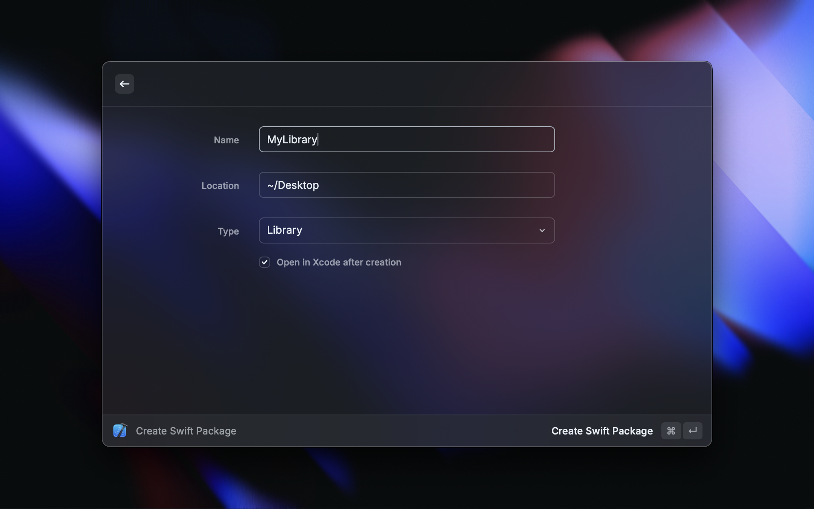
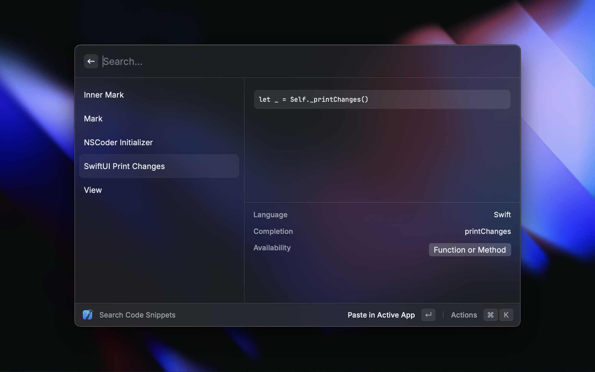

<p align="center">
    
</p>

<h1 align="center">Xcode Extension for Raycast</h1>

<p align="center">
    Search and open your recent Xcode Projects, manage your Simulators & Apps, 
    <br/>
    search the Apple Developer Documentation view the latest Releases and quickly clear Xcode cache files.
    <br/><br/>
    <a title="Install Xcode Raycast Extension" href="https://www.raycast.com/SvenTiigi/xcode#install">
        
    </a>    
</p>

## Development

Open the project in your IDE of choice and install the dependencies via:

```bash
$ npm install
```

To run and test the Xcode extension locally:

```bash
$ npm run dev
```

## Project structure

Inside the `/src` directory you will find the source files for this extension.

| Directory      | Description                                                   |
|----------------|---------------------------------------------------------------|
| src/           | The Raycast commands                                          |
| src/models     | The model definition files                                    |
| src/services   | The services providing the core functionality for a component |
| src/shared     | Shared functions                                              |
| src/components | The components such as List and List.Items                    |

## Showcases

### Search Recent Projects


### Manage Simulators



### Create Swift Package



### Xcode Releases



### Search Apple Developer Documentation



### Add Swift Package

