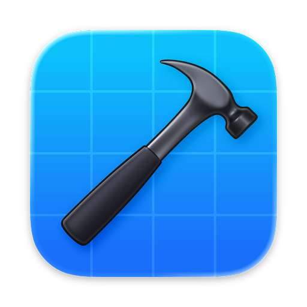

<p align="center">
    
</p>

<h1 align="center">Xcode Extension for Raycast</h1>

<p align="center">
    Search and open your recent Xcode Projects, manage your Simulators & Apps, 
    <br/>
    search the Apple Developer Documentation view the latest Releases and quickly clear Xcode cache files.
    <br/>
    <a href="https://www.raycast.com/SvenTiigi/xcode">
        View in Raycast Store
    </a>
</p>

## Development

Open the project in your IDE of choice and install the dependencies via:

```bash
$ npm install
```

To run and test the Xcode extension locally:

```bash
$ npm run dev
```

## Project structure

Inside the `/src` directory you will find the source files for this extension.

| Directory           | Description                                                 |
| ------------------- | ----------------------------------------------------------- |
| src/                | The Raycast commands                                        |
| src/models          | The model definition files                                  |
| src/services        | The services providing the core functionality for a command |
| src/shared          | Shared constants/functions                                  |
| src/user-interfaces | The user interface files such as Lists and List.Items       |
