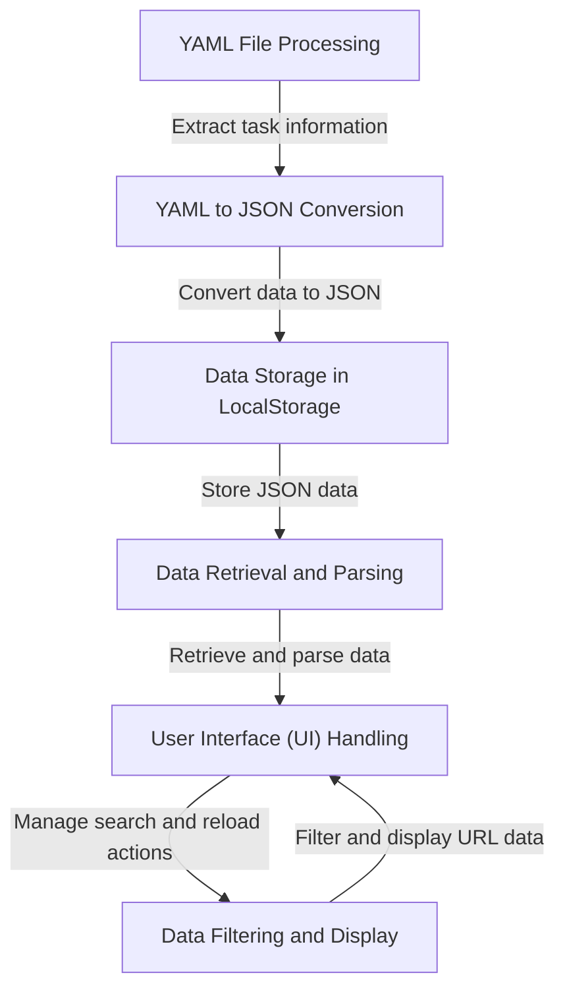

```mermaid
graph TD;
    A[YAML File Processing] -->|Extract task information| B[YAML to JSON Conversion]
    B -->|Convert data to JSON| C[Data Storage in LocalStorage]
    C -->|Store JSON data| D[Data Retrieval and Parsing]
    D -->|Retrieve and parse data| E["User Interface (UI) Handling"]
    E -->|Manage search and reload actions| F[Data Filtering and Display]
    F -->|Filter and display URL data| E
```
