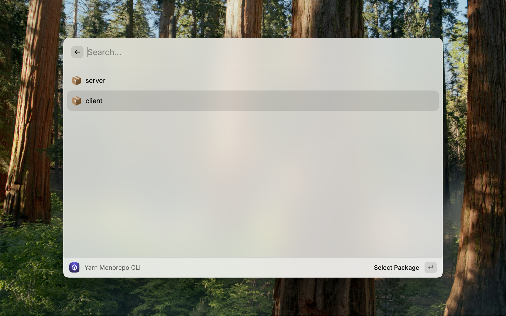
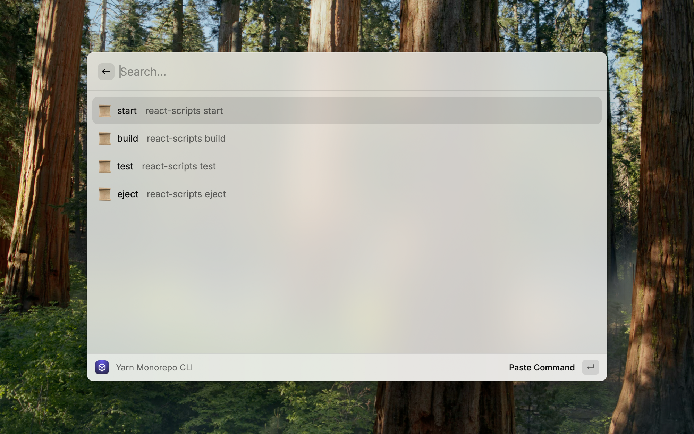

# Yarn Monorepo CLI

Manage your yarn monorepo

Raycast extension to effortlessly manage your Yarn monorepo! Quickly browse and select packages or scripts from an intuitive list, then seamlessly paste commands into your active terminal window—saving you time and streamlining your workflow.

| Select package                               | Select script from the package              |
|----------------------------------------------|---------------------------------------------|
|  |  |
