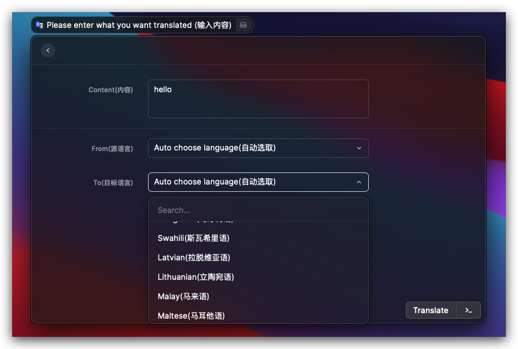
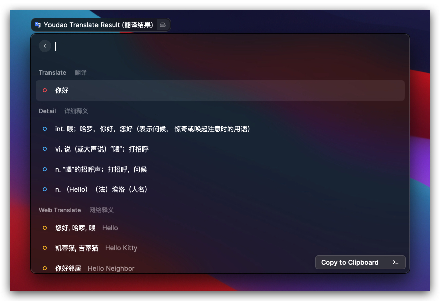
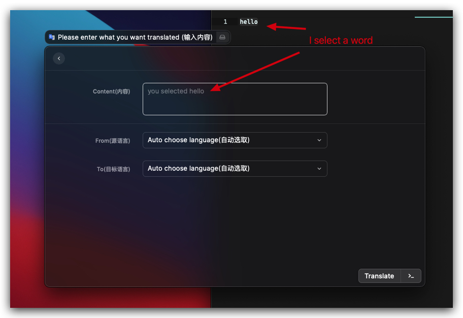

# Raycast Youdao Translate

This extension brings Youdao translate to Raycast!

**Support cross word translation, Supports 111 languages**

### Cross Word Translation

- select content before activate Raycast
- Activate Raycast and open Youdao Translate
  
- Enter <enter> Button

**If user input and select content exist at the same time, user input prevails**
