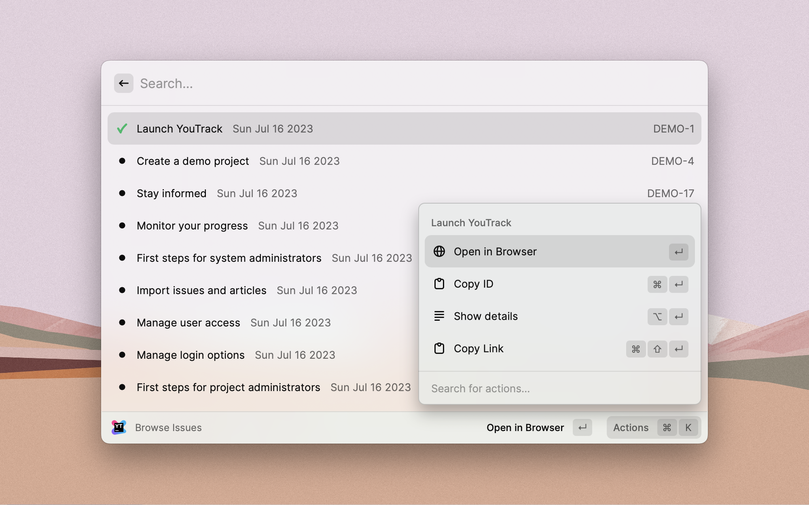

  
  <h1>
    YouTrack
  </h1>

Raycast extension to browse YouTrack issues.

  

    
    
    
    
  

## Features

- Browse issues:
  - Open the issue in browser
  - Copy the issue ID – so you can mention it in your commit message
  - Customize the search query
- ... potentially, more – request it [here](https://github.com/raycast/extensions/issues/new?template=extension_feature_request.yml&extension-url=https%3A%2F%2Fraycast.com%2Ftiulpin%2Fyoutrack&title=%5BYouTrack%5D+...)

## How to get the access token for the YouTrack REST API

Refer to [the official documentation](https://www.jetbrains.com/help/youtrack/standalone/Manage-Permanent-Token.html#obtain-permanent-token) and note: you need only `YouTrack` scope for the token.

After setting up your token you should be able to browse your YouTrack issues with Raycast 🚀.

## Showcases

