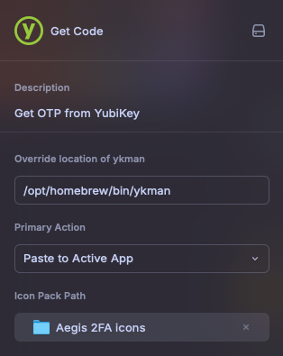

# YubiKey Code

Easily get a OTP from your YubiKey

## Requirements

- [ykman](https://docs.yubico.com/software/yubikey/tools/ykman/Install_ykman.html#macos) (`brew install ykman`)

## Setup

To start using the extension, simply provide your path to `ykman` and select your preferred primary action.

You can also provide a path to a custom icon pack. Icon packs must follow the [Aegis Icon Pack Format](https://github.com/beemdevelopment/Aegis/blob/master/docs/iconpacks.md). You can download a pre-built icon pack from https://aegis-icons.github.io/, or build your own.

