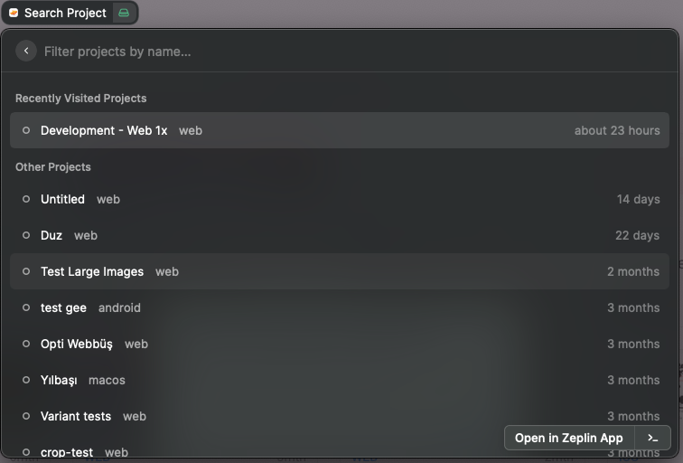
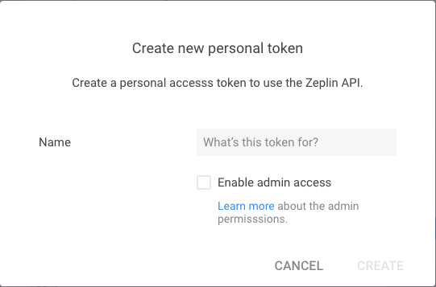

# Zeplin Project Search

Quickly list and search your Zeplin projects.

## Features:

- List all the projects you have access in Zeplin with last updated projects on the top.
- Search and filter projects with the name.
- Easily open the project in web or mac application.
- If you open a project the extension saves it under "Recently Viewed" and shows it on the top.
- Leave from a project directly from this extension if you are no longer working with it.

## Setup

You'll need a Personal Access Token to use this extension. To create this, login to your zeplin account in browser and go to https://app.zeplin.io/profile/developer and click "Create new token" on the "Personal access tokens" section. You can give a name like "Raycast Extension", you don't need to give it "admin access" since this extension does not require it.

