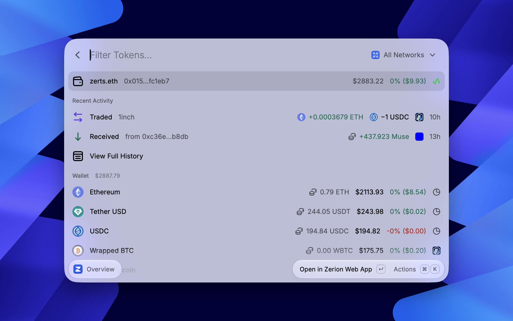

# Zerion

Browse [Zerion](https://app.zerion.io/explore) via Raycast.

Monitor any account directly in the Raycast!
Easy access your favorites, view all NFTs in a collection, and stay updated with real-time market insights with quick links to the Zerion web app!

## Setup

The extension is powered by the public [Zerion API](https://developers.zerion.io). The first time you run a command, a sign-in page opens in your browser — sign in with Zerion, click **Allow**, and you're done. A free API key from [dashboard.zerion.io](https://dashboard.zerion.io) is connected to the extension automatically.

The free Developer plan includes 60,000 requests per month — plenty for everyday use. Commands that simply open the Zerion web app (Favorites, Market, Top Gainers, Top Losers, Collections) work without signing in.

To disconnect, use the **Log Out** button in the extension's Raycast preferences.
