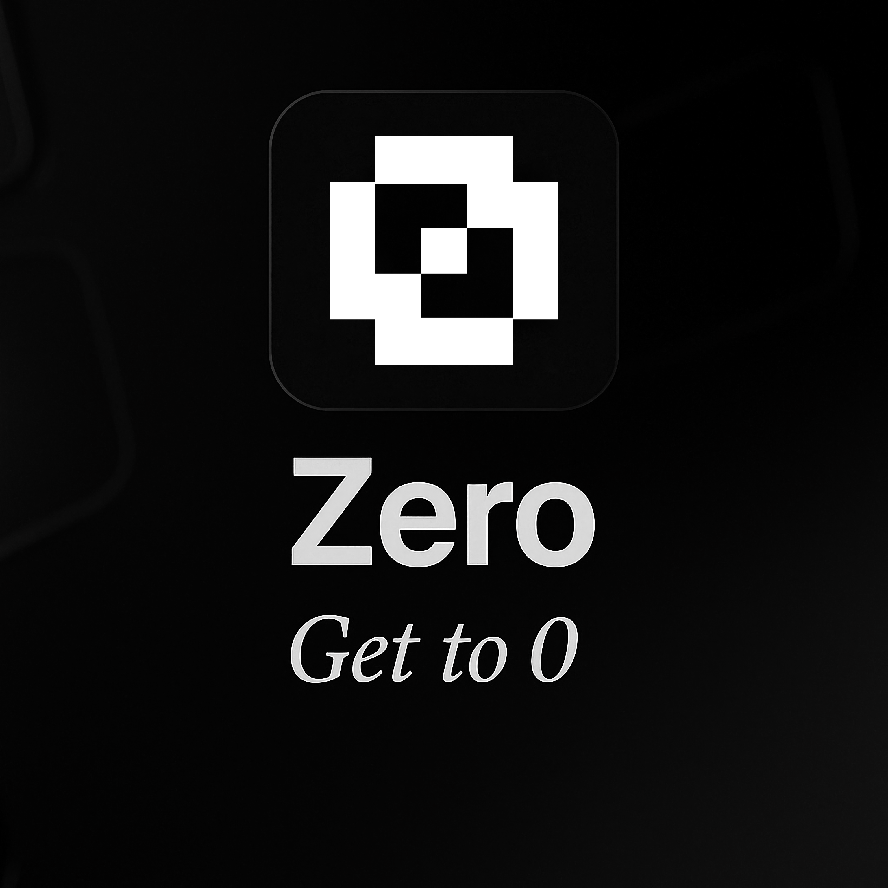

# Zero

A Raycast extension for seamless integration with [Zero](https://github.com/mail-0/zero)

## Features

- **Draft Email Tool**: Create email drafts directly from Raycast with recipients, subject, and body
- **AI Integration**: Use natural language to draft emails through Raycast AI commands
- **Email Formatting**: Automatically handles formatting, including conversion of markdown links to plain text

## Usage

### AI Commands
You can interact with the Zero extension using natural language:

```
@zero Draft an email to john@example.com about the meeting tomorrow
```

### Tools
The extension provides the following tool that can be used with Raycast AI:

- **Draft Email**: Create a new email draft with recipient (to, cc, bcc), subject, and body content

## Preferences

- **Enable Draft Previews**: Show a preview of the email before creating it, allowing you to review before opening in zero

## Development

### Prerequisites
- Node.js 20 or later
- npm

### Setup
```bash
# Clone the repository
git clone https://github.com/jlokos/zero-raycast.git
cd zero-raycast

# Install dependencies
npm install

# Run in development mode
npm run dev
```

## License

MIT

## Privacy

This extension respects your privacy and data security. Data is processed according to Raycast's privacy policy.
