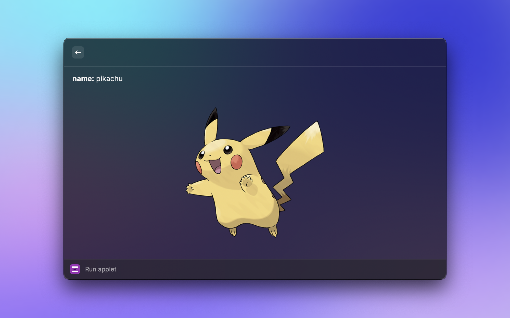

# Raycast Extension for Zipper.dev Applets

This extension allows Raycast users to execute applets from Zipper.dev directly through Raycast.

## Features

- Run any Zipper.dev applet by typing its slug and the script name.
- Automatic fetching and user input for applet requirements.
- Display results directly in Raycast.

## Usage

To use the extension, follow these steps:

1. Invoke Raycast and type the command assigned to this extension.
2. When prompted, enter the `slug` of the applet you wish to run (e.g., `zipper-dex`).
3. Enter the name of the script file (e.g., `main.ts`).
4. If the applet requires additional inputs, a form will be displayed to collect the necessary information.
5. Fill out the inputs as required and submit.
6. The applet will run, and the results will be displayed within Raycast.

## Example

To run the `zipper-dex` applet with the `main.ts` script:

Fill the inputs

See the results!

