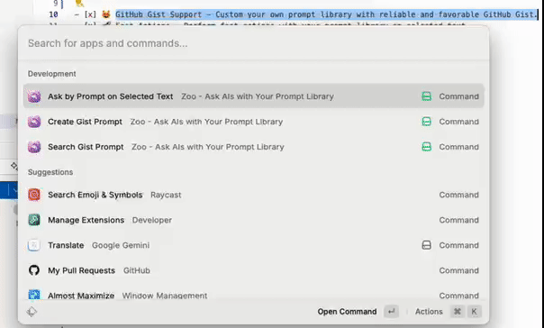

# Zoo - Interact with AIs with Your Prompt Library with Ease

Zoo allows you to interact with AI models using your own prompt library.
It can perform fast actions using your Github Gist as your prompt library.
🦄 Zoo = XXX Fast Actions + GitHub Gist
You can define unlimited number of your own fast AI actions, which is missing for most Raycast AI extensions.

## Features

- [x] 😻 GitHub Gist Support - Custom your own prompt library with reliable and favorable GitHub Gist.
- [x] 🚀 Fast Actions - Perform fast actions with your prompt library on selected text.
- [x] 🤖 AI Models - Interact with most existing AI models with ease, including DeepSeek, OpenAI ChatGPT, Google Gemini.

### Roadmap

- [ ] ♻️ Refactor Code - Refactor code for better performance and maintainability.
- [ ] ⌨️ Ask with extra arguments - Allow users to input extra arguments for the prompt.
- [ ] 📚 Optimize Gist for better prompt use
  - [ ] 🎏 Add filter function - Distinguish prompts from normal gists.
- [ ] 🐞 Fix 'Refusing to paginate further as it could cause the extension to run out of memory. Currently using: xx.xxMB`
- [ ] 💾 Get browser content
- [ ] 💸 Accumulate the money cost and show

### Issues

- [ ] 🐞 Fix 'Refusing to paginate further as it could cause the extension to run out of memory. Currently using: xx.xxMB`

```shell
event -  changed file package.json
info  -  entry points [src/search-gists.tsx src/ask-gist.tsx src/create-gist.tsx]
info  -  compiled entry points
info  -  generated extension's TypeScript definitions
ready -  built extension successfully
17:37:14.476 Refusing to paginate further as it could cause the extension to run out of memory. Currently using: 50.797MB.
17:37:14.476 Refusing to paginate further as it could cause the extension to run out of memory. Currently using: 52.076MB.
```

## How to Use?

The workflow should be like:

1. Create a gist (prompt) as you need, e,g, `Summarize the text`.
2. Select text and call the zoo `ask by prompt on Selected Text` command.
3. choose one prompt from the list (you can use navigate bar to filter prompt).
4. execute the prompt on the selected text; you can copy the result as you want.

<!-- insert a video here-->


### Getting Started

1. Authenticate Zoo with your GitHub account.
2. Set your `LLM API Key`, `LLM API Endpoint`, and `LLM Model Name` in the configuration as needed.
3. [Optional] Set the model price.

🍻 Enjoy! And please feel free to contribute features/fix!

> Credits: This project is highly inspired by [Github Gist](https://www.raycast.com/koinzhang/github-gist) and [ChatGPT Quick Actions](https://www.raycast.com/alanzchen/chatgpt-quick-actions).
