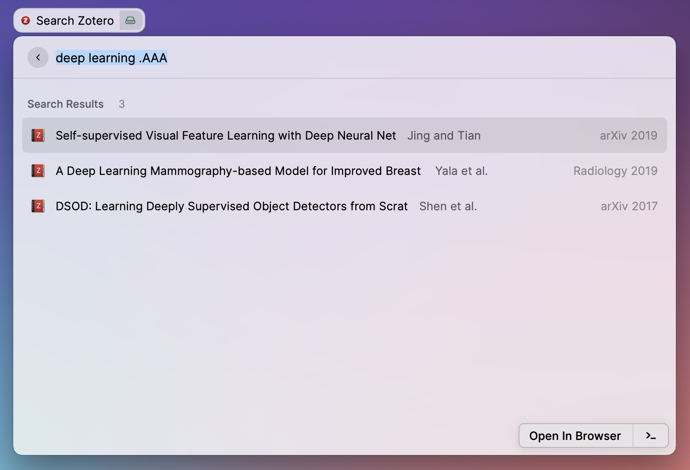
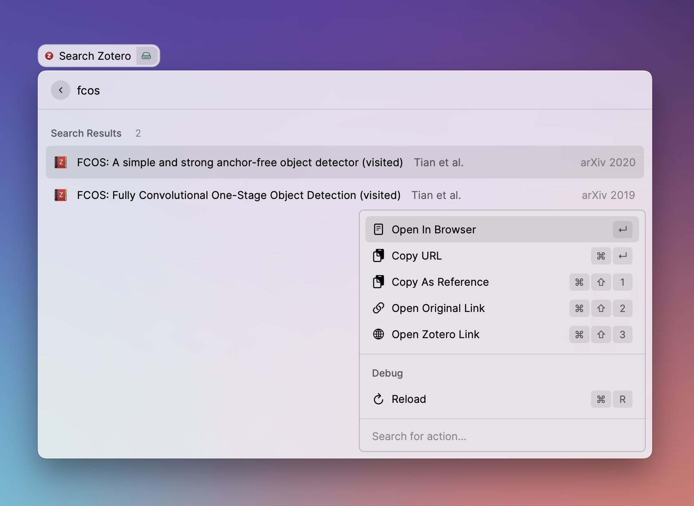

# Raycast Search Zotero

This extension brings [Zotero](https://www.zotero.org/) search to raycast!

**Note: this extension is under active development and is subject to changes.**

## Getting started

Before using the command, you need to retrieve your Zotero API and user ID. This can be easily done
by following [this guide](https://stavanger.instructure.com/courses/6342/pages/finding-zotero-user-id-and-zotero-api-key).

## Features

This extension supports both quick search and tags. `tags` should be prefixed with `.`! Lets consider
this example: "machine learning .python .ML resnet" -> This will search for "machine learning resnet"
with tags of python OR resnet.

Please not that currently only OR operation is supported for the tags.

Please see this guide for additional details about the query patterns.
https://www.zotero.org/support/dev/web_api/v3/basics#search_syntax

This extension support a few sub commands:

- link to the reference in your zotero app (default)
- link to the PDF of your reference in zotero app or default PDF Reader
- copy URL to copy the ORL of the reference
- copy as reference to copy a text for citing this reference
- open original link to open URL in default browser
- open zotero link to open path to reference on online zotero account

Please note that in case a reference has multiple PDF files associated with it, only the first PDF
file returned by the API will be opened.
