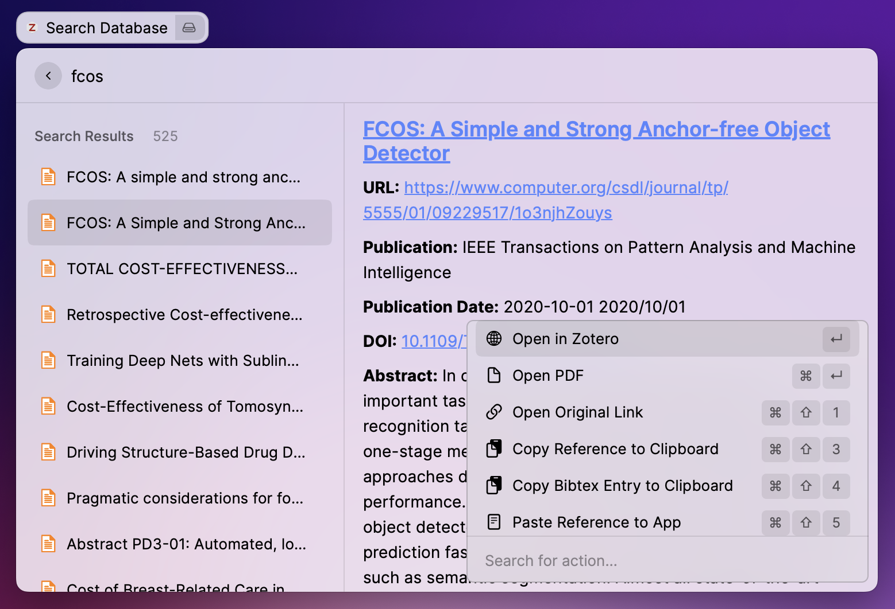
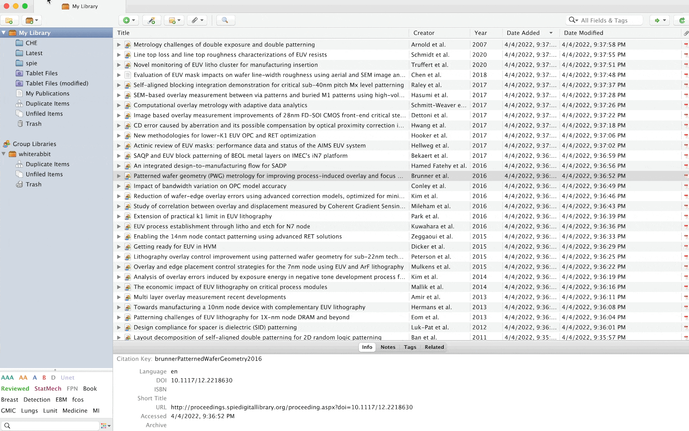
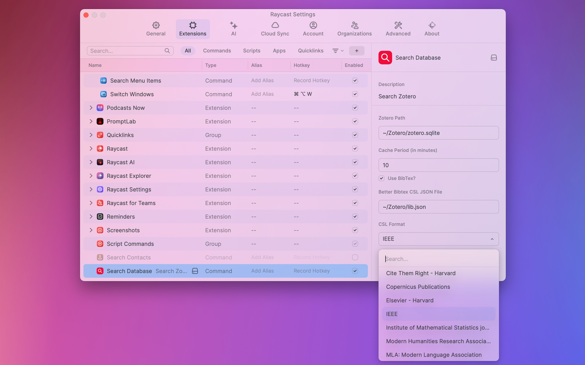
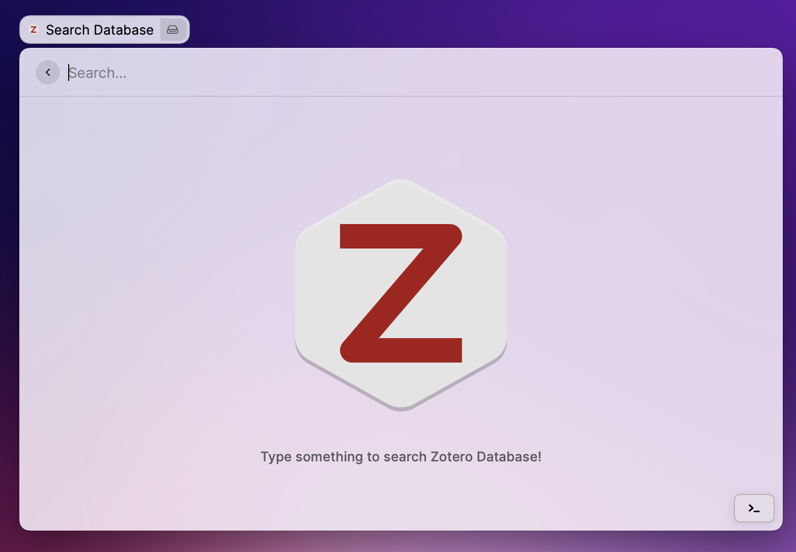

# Raycast Search Zotero

This extension brings [Zotero](https://www.zotero.org/) search to raycast!

## Getting started

This extension reads your local zotero sqlite database to enable searching of references.
In order to avoid creating locks for the database, it creates a copy of the sqlite database with
a suffix of `.raycast`.

## Setup

You need to have [Zotero](https://www.zotero.org/) installed. This extension has few optional
preferences:

- **Zotero Sqlite Path**: Location where your Zotero App sqlite files are kept. By default this is located at
  `$HOME/Zotero/zotero.sqlite`. If you are using an alternate location, you will need to update this.

If you use the Better BibTex zotero extension, you can enable few additional features. Additionally,
you can copy the references in certain CSA styles as well as bibtex entries to clipboard or paste
on the most current Application.

Preferences related to these features are:

- **Cache Period**: Number of minutes for which data will be used from cache. During this
  period, if last updated time of cache is still later than change in zotero database, Cache will be
  used for queries. Otherwise, a new cache will be created and results read directly from zotero database.
  A default of 10 minutes is Used.

- **Whether to use Better BibTex Citation**: If you use the [Better BibTex zotero extension](https://retorque.re/zotero-better-bibtex/), you can enable this flag to copy Better BibTex citation keys for any reference.
- **Search by BibTeX Citation Key**: If you use the Better BibTex zotero extension, you can enable this flag to search references by citation key. With it on, typing a citation key like `smith2020quantum` returns that reference. It only needs the Better BibTex plugin, so you can use it without setting up the CSL JSON file for copy and paste.
- **Better Bibtex CSL JSON File**: Path where you save your auto-updating CSL JSON file. **PLEASE
  NOTE THAT THIS IS MUST IF YOU WANT TO USE THESE FEATURES**. Please see the following screencast
  to setup this properly. You will need to update this entry to the path you chose to save this CSL
  JSON file. By default this is setup to be
  `~/Zotero/lib.json`. If you are not saving yours to this location, please ensure to update this.

- **CSL Format**: This is the style with which you want to copy reference text in clipboard or
  paste in frontmost application. Currently following formats are supported. These are based on
  default formats supported by Zotero.

  - ACS Applied Materials & Interfaces
  - Acta Botanica Croatica
  - ACS: American Chemical Society
  - American Journal of Sociology
  - American Medical Association
  - American Meteorological Society
  - APS: American Physical Society
  - American Political Science Association
  - APA: American Psychological Association
  - American Sociological Association
  - Annual Reviews (author-date)
  - Annual Reviews (alphabetical)
  - Biostatistics
  - Chicago (author-date) Manual of Style
  - Chicago (full note) Manual of Style
  - Chicago (note) Manual of Style
  - Cite Them Right - Harvard
  - Copernicus Publications
  - Elsevier - Harvard
  - IEEE [DEFAULT]
  - Institute of Mathematical Statistics journals
  - Modern Humanities Research Association
  - MLA: Modern Language Association
  - Nature
  - Radiology
  - Vancouver

## Features

On launching the application, the most recent references are shown, and results update as you
type. To speedup queries, sqlite query results are cached locally for 10 minutes.
Additionally, This cache is valid in those 10 minutes, only if your database has not changed since.
Please note that the cache will become invalid if you update preferences.

Search is fuzzy: each query term matches scattered letters in order in the title, tags, authors,
DOI, and collection names, so typing `qsim` finds "Quantum Simulation". Abstracts and notes are
matched as contiguous text, so a phrase from them must appear as-is. Results are ranked by how
well they match. At most 100 results are shown at a time; when a query matches 100 or more, the
section subtitle says "Top 100 — refine your search to see more".

This extension supports different types of searches. Here are some common examples:

1. Query: "YOLO" - search for "YOLO" (case insensitive) in title, abstract, tags, notes, authors and date
2. Query: "YOLO 2020" - search for "YOLO" (case insensitive) in title, abstract, tags, notes, authors &
   date AND for "2020" in title, abstract, tags, notes, authors & date
3. Query: "YOLO+2020" - search for "YOLO 2020" (case insensitive) in title, abstract, tags, notes, authors &
   date
4. Query: "YOLO+2020 Detector" - search for "YOLO 2020" (case insensitive) in title, abstract,
   tags, authors & date AND for "Detector" (case insensitive) in title, abstract, tags, notes, authors
   & date
5. Query: "YOLO+2020 Detector Test+10" - search for "YOLO 2020" (case insensitive) in title, abstract,
   tags, authors & date AND for "Detector" (case insensitive) in title, abstract, tags, notes, authors
   & date AND for "Test 10" (case insensitive) in title, abstract, tags, notes, authors & date
6. Query: "YOLO .AAA" - With tags of "AAA" (case insensitive) AND "YOLO" (case insensitive) in
   title, abstract, tags, notes, authors and date
7. Query: "YOLO .AAA .BBB" - With tags of "AAA" (case insensitive) AND With tags of "AAA"
   (case insensitive) AND "YOLO" (case insensitive) in title, abstract, tags, notes, authors and date
8. Query: "YOLO .AAA+BBB" - With tags of "AAA BBB" (case insensitive) AND "YOLO" (case insensitive)
   in title, abstract, tags, notes, authors and date
9. Query: "YOLO+2020 .AAA+BBB AAA" - With tags of "AAA BBB" (case insensitive) AND "YOLO 2020"
   (case insensitive) in title, abstract, tags, notes, authors and date AND for "AAA" (case
   insensitive) in title, abstract, tags, notes, authors & date
10. Query: "YOLO+2020 .AAA+BBB AAA .CCC" - With tags of "AAA BBB" (case insensitive) AND With tags
    of "CCC" (case insensitive) AND "YOLO 2020"
    (case insensitive) in title, abstract, tags, notes, authors and date AND for "AAA" (case
    insensitive) in title, abstract, tags, notes, authors & date

Note that search for `tags` can be prefixed with `.` explicitly. Tags with spaces should be entered
by replacing "spaces" with "+" characters. Use if multiple query terms prefixed with "." would
search for references with ALL of the queried tags (Examples 7 and 10).

If you want to search for ANY of the tags, you should not prefix it with "." character. For example
in queries 9 and 10, AAA will be searched in tags in only OR/ANY sense.

You can also filter the results to a single collection using the dropdown next to the search bar.
It lists collections from your personal library and the group libraries you have included.
Collections are matched by library and key, so two collections with the same name stay separate,
and the dropdown labels them so you can tell them apart. The filter is applied to the whole
library before the 100-result limit.

This extension support a few sub commands.

- link to the reference in your zotero app (default)
- link to the PDF of your reference in zotero app or default PDF Reader
- copy the PDF file path of your reference to the clipboard
- open original link to open URL in default browser
- Copy BibTex citation key to the clipboard
- copy reference using CSA style to the clipboard
- copy bibtex entry for the paper to the clipboard
- paste reference using CSA style to the frontmost application
- paste bibtex entry for the paper to the frontmost application

Please note that in case a reference has multiple PDF files associated with it, the primary (oldest)
PDF file will be opened, matching Zotero's native behavior.

## Group libraries

By default, only your personal library is searched, so a reference shared to a group does not
show up twice. To include groups, use the "Configure Group Libraries" action (`⌘L`) on any
reference. It shows up when your library has at least one group, and opens a list where you pick
which groups to include. Your personal library is always searched.

References from a group library show the group name after the title, for example
"Title · Group Name", and a `**Library:**` line in the detail view. The "Open in Zotero"
action opens them in the Zotero app.
