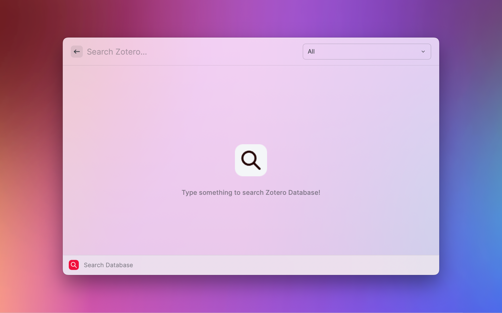

# Raycast Search Zotero

This extension brings [Zotero](https://www.zotero.org/) search to raycast!

## Getting started

This extension reads your local zotero sqlite database to enable searching of references.
In order to avoid creating locks for the database, it creates a copy of the sqlite database with
a suffix of `.raycast`.

## Setup

You need to have [Zotero](https://www.zotero.org/) installed. This extension has few optional
preferences:

- **Zotero Sqlite Path**: Location where your Zotero App sqlite files are kept. By default this is located at
  `$HOME/Zotero/zotero.sqlite`. If you are using an alternate location, you will need to update this.

If you use the Better BibTex zotero extension, you can enable few additional features. Additionally,
you can copy the references in certain CSA styles as well as bibtex entries to clipboard or paste
on the most current Application.

Preferences related to these features are:

- **Whether to use Better BibTex Citation**: If you use the [Better BibTex zotero extension](https://retorque.re/zotero-better-bibtex/), you can enable this flag to copy Better BibTex citation keys for any reference.
- **Better Bibtex CSL JSON File**: Path where you save your auto-updating CSL JSON file. **PLEASE
  NOTE THAT THIS IS MUST IF YOU WANT TO USE THESE FEATURES**. Please see the following screencast
  to setup this properly. You will need to update this entry to the path you chose to save this CSL
  JSON file. By default this is setup to be
  `~/Zotero/lib.json`. If you are not saving yours to this location, please ensure to update this.

- **CSL Format**: This is the style with which you want to copy reference text in clipboard or
  paste in frontmost application. Currently following formats are supported. These are based on
  default formats supported by Zotero.

  - APA: American Psychological Association  [DEFAULT]
  - ACS: American Chemical Society
  - AMA: American Medical Association
  - APSA: American Political Science Association
  - ASA: American Sociological Association
  - HARVARD: Elsevier Harvard
  - IEEE: IEEE Publications
  - Nature: Nature Publications
  - Vancouver: Vancouver system

## Features

On launching the application, you will get and empty view. The results will only show up when you
type any search query. To speedup queries, sqlite query results are cached locally for 1 hour.
Additionally, This cache is valid even after 1 hour, if your database has not changed since. Please
note that the cache will become invalid if you update preferences.

This extension supports both quick search and tags. `tags` should be prefixed with `.`!

Lets consider this example: "machine learning .python .ML resnet" -> This will search for "machine learning resnet"
with tags of python OR resnet.

If you want to search for tags with whitespaces, please replace every space character by '+'.
For eg. to search for tag, "deep learning", you will need to use ".deep+learning".

Please note that currently only OR operation is supported for the tags.

This extension support a few sub commands.

- link to the reference in your zotero app (default)
- link to the PDF of your reference in zotero app or default PDF Reader
- open original link to open URL in default browser
- copy reference using CSA style to the clipboard
- copy bibtex entry for the paper to the clipboard
- paste reference using CSA style to the frontmost application
- paste bibtex entry for the paper to the frontmost application
- Copy BibTex citation key to the clipboard

Please note that in case a reference has multiple PDF files associated with it, only the first PDF
file returned by the sqlite database will be opened.
