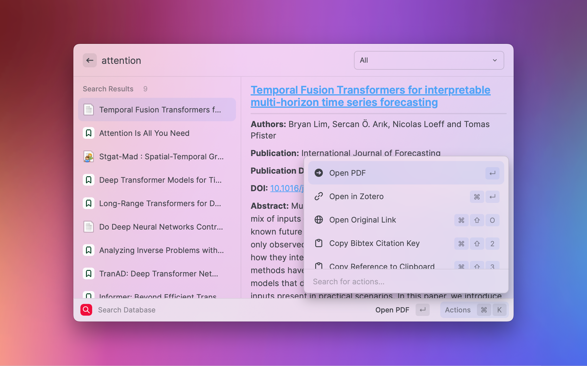

# Raycast Search Zotero

This extension brings [Zotero](https://www.zotero.org/) search to raycast!

## Getting started

This extension reads your local zotero sqlite database to enable searching of references.
In order to avoid creating locks for the database, it creates a copy of the sqlite database with
a suffix of `.raycast`.

## Setup

You need to have [Zotero](https://www.zotero.org/) installed. This extension has two optional
preferences:

- **Zotero Sqlite Path**: Location where your Zotero App sqlite files are kept. By default this is located at
  `$HOME/Zotero/zotero.sqlite`. If you are using an alternate location, you will need to update this.
- **Whether to use Better BibTex Citation**: If you use the [Better BibTex zotero extension](https://retorque.re/zotero-better-bibtex/), you can
  enable this flag to copy Better BibTex citation keys for any reference.

## Features

This extension supports both quick search and tags. `tags` should be prefixed with `.`!

Lets consider this example: "machine learning .python .ML resnet" -> This will search for "machine learning resnet"
with tags of python AND resnet.

Please not that currently only AND operation is supported for the tags.

This extension support a few sub commands.

- link to the reference in your zotero app (default)
- link to the PDF of your reference in zotero app or default PDF Reader
- open original link to open URL in default browser
- Copy BibTex citation key

Please note that in case a reference has multiple PDF files associated with it, only the first PDF
file returned by the sqlite database will be opened.
