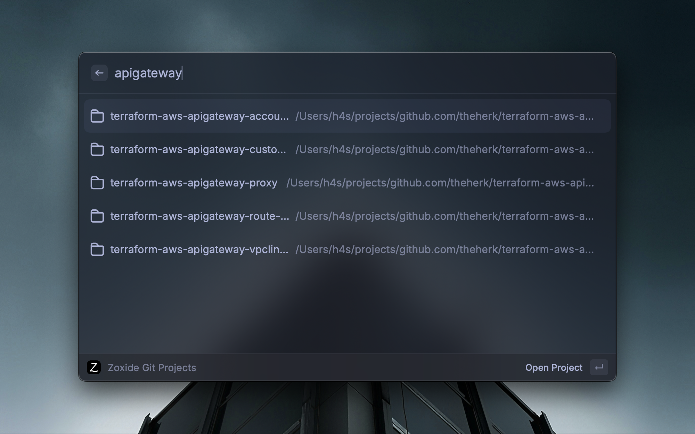

# Zoxide Git Projects

Allows the user to select git repositories found by filtering a zoxide query, then open them in an application of choice.

I use and love [zoxide](https://github.com/ajeetdsouza/zoxide) ❤️. With this extension, all the directories returned by `zoxide query -l` (i.e. the directories you use) are filtered to just those that are git repositories and ordered by most frequently used. From there, this extension allows you to fuzzy find a specific project, then open that project with the tool of your choice. For me, [zed](https://zed.dev/).

